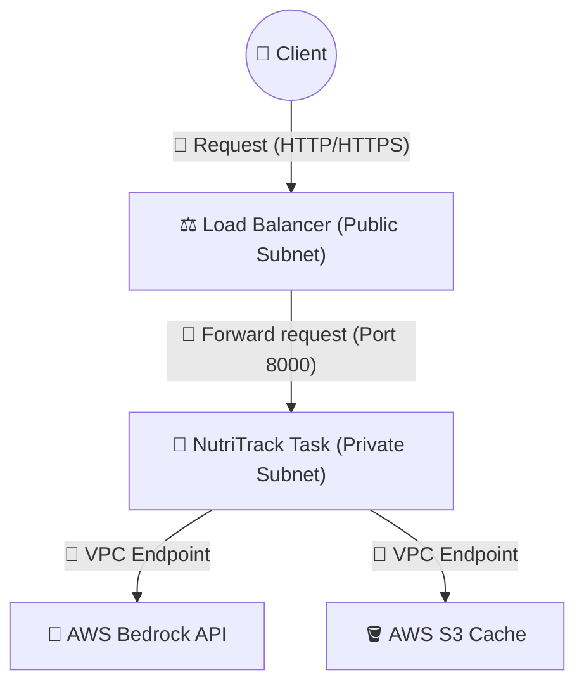

# Hướng dẫn Bảo mật Mạng cho NutriTrack API (2 Giải pháp)

Tài liệu này cung cấp 2 giải pháp thiết lập mạng từ mức độ "Tiết kiệm & Chặt chẽ" đến mức "Chuyên nghiệp & Tuyệt đối bảo mật" để bạn lựa chọn tùy theo mục tiêu của mình.

---

## 🔒 Giải pháp 1: Security Group Chặt chẽ (Tiết kiệm tối đa)

**Mô hình:** Chạy Container trực tiếp trong **Public Subnet** nhưng dùng "Tường lửa" Security Group để khóa mọi cổng trừ cổng API.

### 1. Ưu & Nhược điểm:
*   **Ưu điểm:** Miễn phí (không tốn tiền cho Load Balancer hay NAT Gateway). Cài đặt nhanh.
*   **Nhược điểm:** Container bị lộ IP Public. Nếu cấu hình sai Security Group, server sẽ bị tấn công.

### 2. Cấu hình Security Group (Lớp giáp bảo vệ):
1.  **Inbound Rules (Quyền đi vào):**
    *   **Type:** `Custom TCP` | **Port:** `8000` | **Source:** `0.0.0.0/0` (Cho phép mọi người gọi API).
    *   **TUYỆT ĐỐI KHÔNG** mở port 22 (SSH) hay 3306 (MySQL) hay bất kỳ port nào khác.
2. **Outbound Rules (Quyền đi ra):**
    *   **Destination:** `0.0.0.0/0` | **Type:** `All Traffic` (Mặc định).
    *   **Giải thích:** Code Python cần gọi ra ngoài Internet để kết nối với AWS Bedrock và S3 (thông qua Public Endpoint). Việc để `0.0.0.0/0` ở chiều đi ra là an toàn vì Security Group là **Stateful** (nó tự biết chỉ cho phép dữ liệu phản hồi về đúng phiên làm việc mà code đã yêu cầu khởi tạo).

---

## 🛡️ Giải pháp 2: ALB + Private Subnet (Chuyên nghiệp - "Show off" Kỹ năng)

**Mô hình:** Container chạy trong vùng "văn phòng kín" (**Private Subnet**), chỉ có duy nhất **Load Balancer** (người tiếp tân) được phép tiếp xúc với thế giới bên ngoài.

### 1. Sơ đồ kiến trúc:

### 2. Các bước thiết lập "Pro":

#### Bước A: Tạo thêm Private Subnet (Không có Internet)
1.  Tạo Subnet mới (`nutritrack-private-subnet`) trong cùng VPC.
2.  **KHÔNG** bật "Auto-assign public IP".
3.  Route Table của subnet này **KHÔNG** được trỏ tới Internet Gateway.

#### Bước B: Tạo Application Load Balancer (ALB)
1.  Vào EC2 Console -> **Load Balancers** -> **Create ALB**.
2.  Scheme: **Internet-facing**.
3.  Network mapping: Chọn **VPC** và các **Public Subnets** của bạn.
4.  Security Group cho ALB:
    *   **Allow Port 80** từ `0.0.0.0/0`. 
5.  Listeners and routing: Tạo một **Target Group** (Type: IP) trỏ tới port 8000 của Fargate.

#### Bước C: Chuỗi "Tường lửa" (Security Group Chain)
Đây là phần thể hiện tư duy bảo mật:
1.  **SG của ALB:** Cho phép cổng 80 (hoặc 443) từ Internet.
2.  **SG của Fargate Task:** **CHỈ** cho phép cổng 8000 từ chính **Security Group của ALB**. 
    *(Nghĩa là: Hacker có biết IP nội bộ của container cũng không thể gọi trực tiếp, bắt buộc phải đi qua ALB).*

#### Bước D: Giải quyết vấn đề gọi Bedrock (VPC Endpoints)
Vì Private Subnet không có Internet, code Python sẽ không gọi được Bedrock. Để xử lý mà không tốn $32/tháng cho NAT Gateway, bạn hãy dùng **Interface VPC Endpoints**:
1.  Vào VPC Console -> **Endpoints** -> **Create endpoint**.
2.  Service: Tìm `bedrock-runtime` và `s3`.
3.  VPC: Chọn `nutritrack-vpc`.
4.  Subnets: Chọn các Private Subnets của bạn.
5.  Security Group: Cho phép port **443** (HTTPS) từ Fargate Task.

---

## 📊 Bảng so sánh tổng hợp

| Tiêu chí | Giải pháp 1 (Public + SG) | Giải pháp 2 (ALB + Private) |
| :--- | :--- | :--- |
| **Bảo mật** | Khá (Dựa trên port) | **Tuyệt đối** (Dựa trên kiến trúc mạng) |
| **Độ khó** | Dễ (15 phút) | Khó (60 phút) |
| **Chi phí** | **0$** | **~$15 - $20/tháng** (Phí duy trì ALB) |
| **Thẩm mỹ** | URL có IP: `http://3.86.xx:8000` | URL chuyên nghiệp: `nutritrack-lb-123.aws.com` |
| **Khuyên dùng** | Khi làm Dev/Test nhanh | Khi làm đồ án cuối kỳ, trình diễn hệ thống lớn |

> [!TIP]
> Nếu bạn chọn **Giải pháp 2**, hãy chụp ảnh sơ đồ mạng (Diagram) phía trên để đưa vào báo cáo đồ án. Đảm bảo giáo viên sẽ đánh giá rất cao khả năng thiết kế hạ tầng Cloud bài bản của bạn!
