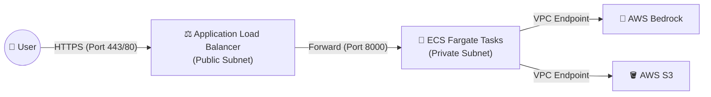

```mermaid    
graph LR
    User((👦 User)) -- "HTTPS (Port 443/80)" --> ALB["⚖️ Application Load Balancer<br>(Public Subnet)"]
    ALB -- "Forward (Port 8000)" --> Fargate["🐋 ECS Fargate Tasks<br>(Private Subnet)"]
    Fargate -- "VPC Endpoint" --> Bedrock["🧠 AWS Bedrock"]
    Fargate -- "VPC Endpoint" --> S3["🪣 AWS S3"]
```