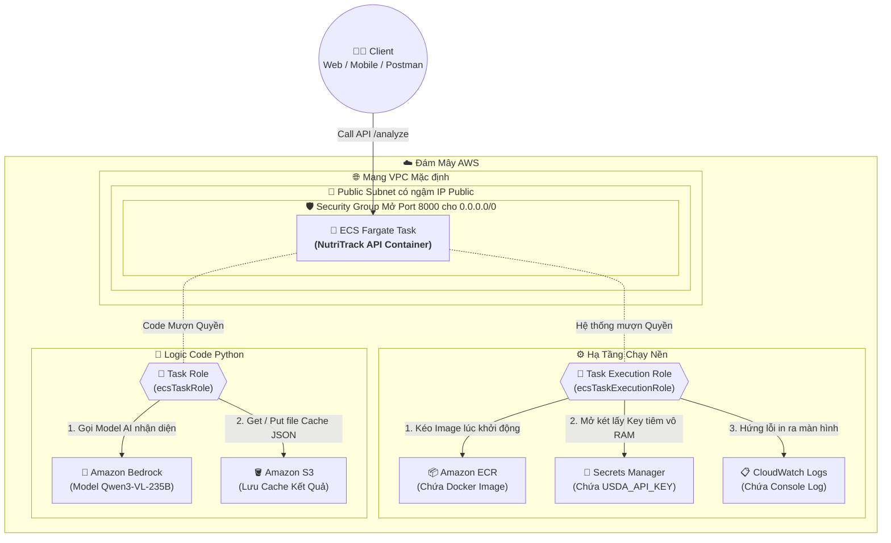

```mermaid    
graph TD
    User((👦🏻 Client<br>Web / Mobile / Postman))

    subgraph AWS [☁️ Đám Mây AWS]
        
        subgraph VPC [🌐 Mạng VPC Mặc định]
            subgraph Subnet [📍 Public Subnet có ngậm IP Public]
                subgraph SG [🛡️ Security Group Mở Port 8000 cho 0.0.0.0/0]
                    Fargate["🐋 ECS Fargate Task<br><b>(NutriTrack API Container)</b>"]
                end
            end
        end

        subgraph ECS_System [⚙️ Hạ Tầng Chạy Nền]
            TaskExecRole{{"🔑 Task Execution Role<br>(ecsTaskExecutionRole)"}}
            ECR["📦 Amazon ECR<br>(Chứa Docker Image)"]
            Secrets["🔐 Secrets Manager<br>(Chứa USDA_API_KEY)"]
            CW["📋 CloudWatch Logs<br>(Chứa Console Log)"]
        end

        subgraph App_Python [🤖 Logic Code Python]
            TaskRole{{"🔑 Task Role<br>(ecsTaskRole)"}}
            Bedrock["🧠 Amazon Bedrock<br>(Model Qwen3-VL-235B)"]
            S3["🪣 Amazon S3<br>(Lưu Cache Kết Quả)"]
        end
    end

    %% Luồng đi của User
    User -- "Call API /analyze" --> Fargate

    %% Luồng đi của hệ thống kéo thiết lập
    Fargate -.-|Hệ thống mượn Quyền| TaskExecRole
    TaskExecRole -->|1. Kéo Image lúc khởi động| ECR
    TaskExecRole -->|2. Mở két lấy Key tiêm vô RAM| Secrets
    TaskExecRole -->|3. Hứng lỗi in ra màn hình| CW

    %% Luồng đi của Code Python
    Fargate -.-|Code Mượn Quyền| TaskRole
    TaskRole -->|1. Gọi Model AI nhận diện| Bedrock
    TaskRole -->|2. Get / Put file Cache JSON| S3
```
