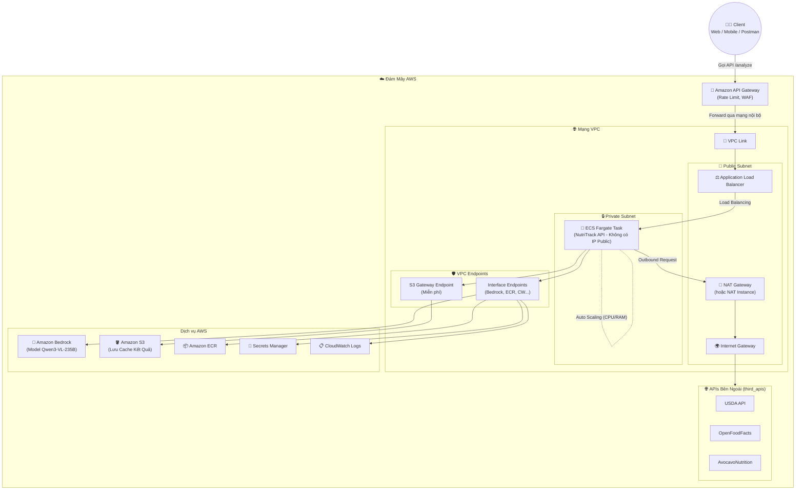

```mermaid
graph TD
    User((👦🏻 Client<br>Web / Mobile / Postman))

    subgraph AWS [☁️ Đám Mây AWS]
        
        AGW["🚪 Amazon API Gateway<br>(Rate Limit, WAF)"]
        
        subgraph VPC [🌐 Mạng VPC]
            VPC_Link["🔗 VPC Link"]
            
            subgraph Public_Subnet [📍 Public Subnet]
                ALB["⚖️ Application Load Balancer"]
                NAT["🔄 NAT Gateway<br>(hoặc NAT Instance)"]
                IGW["🌍 Internet Gateway"]
            end
            
            subgraph Private_Subnet [🔒 Private Subnet]
                Fargate["🐋 ECS Fargate Task<br>(NutriTrack API - Không có IP Public)"]
            end
            
            subgraph VPC_Endpoints [🛡️ VPC Endpoints]
                S3_VPCE["S3 Gateway Endpoint<br>(Miễn phí)"]
                Interface_VPCE["Interface Endpoints<br>(Bedrock, ECR, CW...)"]
            end
        end

        subgraph External_APIs ["🌐 APIs Bên Ngoài (third_apis)"]
            USDA["USDA API"]
            OFF["OpenFoodFacts"]
            Avocavo["AvocavoNutrition"]
        end

        subgraph AWS_Services [Dịch vụ AWS]
            Bedrock["🧠 Amazon Bedrock<br>(Model Qwen3-VL-235B)"]
            S3["🪣 Amazon S3<br>(Lưu Cache Kết Quả)"]
            ECR["📦 Amazon ECR"]
            Secrets["🔐 Secrets Manager"]
            CW["📋 CloudWatch Logs"]
        end
    end

    %% Luồng đi của User
    User -->|Gọi API /analyze| AGW
    AGW -->|Forward qua mạng nội bộ| VPC_Link
    VPC_Link --> ALB
    ALB -->|Load Balancing| Fargate

    %% Hệ thống Auto Scaling
    Fargate -.-|"Auto Scaling (CPU/RAM)"| Fargate

    %% Luồng đi gọi External APIs (Egress)
    Fargate -->|Outbound Request| NAT
    NAT --> IGW
    IGW --> External_APIs

    %% Luồng đi gọi AWS Services (Nội bộ tối ưu phí & bảo mật)
    Fargate --> S3_VPCE
    S3_VPCE --> S3
    
    Fargate --> Interface_VPCE
    Interface_VPCE --> Bedrock
    Interface_VPCE --> ECR
    Interface_VPCE --> Secrets
    Interface_VPCE --> CW
```
