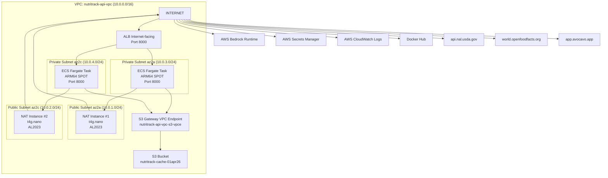

# 🚀 Workshop: Deploy NutriTrack API lên ECS Private + NAT Instance (HA)

> **Mục tiêu:** Hướng dẫn từng bước setup hạ tầng AWS cho NutriTrack API trên ECS Fargate Private Subnet, sử dụng NAT Instance (thay vì NAT Gateway đắt tiền), với ALB + Auto Scaling + High Availability trên 2 Availability Zone.
>
> **Đối tượng:** Người chưa biết hoặc mới biết về AWS — làm theo từng bước là thành công.
>
> **Region:** `ap-southeast-2` (Sydney, Australia)
>
> **Thời gian ước tính:** 3–4 giờ

---

## 📋 Mục lục

| #    | Phần                                                                            | Mô tả                                 |
| :--- | :------------------------------------------------------------------------------ | :------------------------------------ |
| 0    | [Tổng quan kiến trúc](#0-tổng-quan-kiến-trúc--flow-cuối-cùng)                   | Sơ đồ, giải thích, flow request       |
| 1    | [Tạo VPC](#1-tạo-vpc)                                                           | Mạng riêng cho toàn bộ hệ thống       |
| 2    | [Tạo Subnets](#2-tạo-subnets)                                                   | 2 Public + 2 Private trên 2 AZ        |
| 3    | [Internet Gateway + Route Tables](#3-internet-gateway--route-tables)            | Kết nối internet cho Public Subnet    |
| 4    | [Security Groups](#4-security-groups)                                           | Tường lửa cho từng thành phần         |
| 5    | [S3 Gateway VPC Endpoint](#5-s3-gateway-vpc-endpoint)                           | Truy cập S3 miễn phí qua private link |
| 6    | [S3 Bucket](#6-s3-bucket)                                                       | Bộ nhớ cache cho NutriTrack           |
| 7    | [Secrets Manager](#7-secrets-manager)                                           | Lưu trữ API keys an toàn              |
| 8    | [IAM Roles](#8-iam-roles)                                                       | Phân quyền cho ECS                    |
| 9    | [NAT Instance Setup](#9-nat-instance-setup)                                     | Internet gateway cho Private Subnet   |
| 10   | [NAT Instance HA — Auto Scaling Group](#10-nat-instance-ha--auto-scaling-group) | Tự phục hồi khi instance sập          |
| 11   | [ECS Cluster + Task Definition](#11-ecs-cluster--task-definition)               | Container runtime                     |
| 12   | [Target Group + ALB](#12-target-group--alb)                                     | Load Balancer công cộng               |
| 13   | [ECS Service + Auto Scaling](#13-ecs-service--auto-scaling)                     | Chạy và scale containers              |
| 14   | [Verify & Monitor](#14-verify--monitor)                                         | Xác nhận mọi thứ hoạt động            |
| 15   | [Tính toán chi phí](#15-tính-toán-chi-phí)                                      | Breakdown chi phí hàng tháng          |
| 16   | [Cleanup](#16-cleanup)                                                          | Dọn dẹp khi không dùng                |
| 17   | [Final Flow Tổng kết](#17-final-flow-tổng-kết)                                  | Luồng traffic đầy đủ                  |

---

## 0. Tổng quan kiến trúc & Flow cuối cùng

### 0.1 Tại sao chọn kiến trúc này?

| Quyết định                          | Lý do                                                           |
| :---------------------------------- | :-------------------------------------------------------------- |
| **ECS Private Subnet**              | Container không có IP public → không ai tấn công trực tiếp được |
| **ALB Internet-facing**             | Điểm duy nhất nhận request từ internet, che giấu IP container   |
| **NAT Instance** (thay NAT Gateway) | Tiết kiệm **~70%** chi phí ($10/tháng vs $34/tháng)             |
| **S3 Gateway VPCE**                 | Truy cập S3 **miễn phí**, không qua internet, không qua NAT     |
| **NAT Instance × 2 (1 mỗi AZ)**     | HA thực sự: AZ này sập, AZ kia vẫn chạy bình thường             |
| **Fargate SPOT ARM64**              | Tiết kiệm thêm 70% chi phí compute                              |

### 0.2 Sơ đồ kiến trúc

```
                        ┌─────── INTERNET ───────┐
                        │                        │
                        ▼                        │
              ┌─────────────────────┐            │ (Docker Hub pull
              │  ALB Internet-facing│            │  External APIs)
              │  nutritrack-api-vpc-alb           │
              │  SG: nutritrack-api-vpc-alb-sg    │
              └────────┬────────────┘            │
                       │ Port 8000               │
        ┌──────────────┴──────────────────────────────────────────────┐
        │                  VPC: nutritrack-api-vpc                    │
        │                    CIDR: 10.0.0.0/16                        │
        │                                                             │
        │  ┌─── PUBLIC SUBNET az2a ───┐  ┌─── PUBLIC SUBNET az2c ──┐ │
        │  │ nutritrack-api-public-   │  │ nutritrack-api-public-  │ │
        │  │ subnet-alb01 10.0.1.0/24 │  │ subnet-alb02 10.0.2.0/24│ │
        │  │                          │  │                         │ │
        │  │  ┌─────────────────────┐ │  │ ┌─────────────────────┐ │ │
        │  │  │  NAT Instance #1    │ │  │ │  NAT Instance #2    │ │ │
        │  │  │  nutritrack-api-    │ │  │ │  nutritrack-api-    │ │ │
        │  │  │  nat-instance01     │ │  │ │  nat-instance02     │ │ │
        │  │  │  t4g.nano AL2023    │ │  │ │  t4g.nano AL2023    │ │ │
        │  │  │  (ASG min=1)       ─┼─┼──┼─┼─► Internet         │ │ │
        │  │  └─────────────────────┘ │  │ └─────────────────────┘ │ │
        │  └──────────────────────────┘  └─────────────────────────┘ │
        │             ▲  ▲                       ▲  ▲                │
        │          Port 8000                  Port 8000              │
        │             │  │  (default route)      │  │                │
        │  ┌─── PRIVATE SUBNET az2a ─┐  ┌─── PRIVATE SUBNET az2c ─┐ │
        │  │ nutritrack-api-private- │  │ nutritrack-api-private-  │ │
        │  │ subnet-ecs01 10.0.3.0/24│  │ subnet-ecs02 10.0.4.0/24│ │
        │  │                          │  │                         │ │
        │  │  ┌─────────────────────┐ │  │ ┌─────────────────────┐ │ │
        │  │  │  ECS Fargate Task   │ │  │ │  ECS Fargate Task   │ │ │
        │  │  │  ARM64 SPOT         │ │  │ │  ARM64 SPOT         │ │ │
        │  │  │  Port 8000          │ │  │ │  Port 8000          │ │ │
        │  │  └──────────┬──────────┘ │  │ └──────────┬──────────┘ │ │
        │  └─────────────┼────────────┘  └────────────┼────────────┘ │
        │                │                             │              │
        │  ┌─────────────┴─────────────────────────────┘              │
        │  │         S3 Gateway VPCE (FREE)                           │
        │  │  nutritrack-api-vpc-s3-vpce                              │
        │  │  → S3 Bucket: nutritrack-cache-01apr26 (ddmmyy)         │
        │  └──────────────────────────────────────────────────────────┘
        └─────────────────────────────────────────────────────────────┘

  Luồng ra Internet qua NAT Instance:
  ├── AWS Bedrock Runtime     (200MB/ngày)
  ├── AWS Secrets Manager     (vài bytes)
  ├── AWS CloudWatch Logs     (vài KB)
  ├── Docker Hub              (200MB/lần pull)
  ├── api.nal.usda.gov        (USDA API)
  ├── world.openfoodfacts.org (OpenFoodFacts)
  └── app.avocavo.app         (Avocavo Nutrition)

  Luồng qua S3 Gateway VPCE (KHÔNG qua NAT):
  └── S3 s3.amazonaws.com     (Cache read/write)
```



### 0.3 Nguồn Internet của từng thành phần

| Thành phần                     | Cách ra Internet                             | Chi phí                |
| :----------------------------- | :------------------------------------------- | :--------------------- |
| S3 `nutritrack-cache-01apr26`  | **S3 Gateway VPCE** — private, không qua NAT | **Miễn phí**           |
| Bedrock Runtime                | NAT Instance → Internet                      | Tính vào data transfer |
| Secrets Manager                | NAT Instance → Internet                      | Tính vào data transfer |
| CloudWatch Logs                | NAT Instance → Internet                      | Tính vào data transfer |
| Docker Hub pull                | NAT Instance → Internet                      | Tính vào data transfer |
| USDA / OpenFoodFacts / Avocavo | NAT Instance → Internet                      | Tính vào data transfer |

---

## 1. Tạo VPC

**VPC (Virtual Private Cloud)** là mạng riêng ảo của bạn trên AWS. Mọi tài nguyên (ECS, ALB, NAT Instance...) đều nằm trong VPC này.

### 1.1 Tạo VPC

1. Đăng nhập **AWS Console** → Region **`ap-southeast-2`** (Sydney).
2. Tìm kiếm **VPC** → Click **VPC**.
3. Cột trái → **Your VPCs** → Nhấn **Create VPC**.
4. Cấu hình:

| Field                   | Giá trị              |
| :---------------------- | :------------------- |
| **Resources to create** | `VPC only`           |
| **Name tag**            | `nutritrack-api-vpc` |
| **IPv4 CIDR**           | `10.0.0.0/16`        |
| **IPv6 CIDR**           | No IPv6 CIDR block   |
| **Tenancy**             | Default              |

5. Nhấn **Create VPC**.

### 1.2 Bật DNS cho VPC

Sau khi tạo xong, VPC cần bật 2 tính năng DNS để ECS và VPC Endpoint hoạt động đúng:

1. Chọn VPC `nutritrack-api-vpc` vừa tạo → **Actions** → **Edit VPC settings**.
2. Bật **2 checkbox**:
   - ✅ `Enable DNS resolution` (Cho phép resolve hostname nội bộ)
   - ✅ `Enable DNS hostnames` (Gán hostname cho EC2/ENI trong VPC)
3. Nhấn **Save**.

> **Tại sao cần bật DNS?** VPC Endpoint Interface sử dụng DNS private để resolve địa chỉ AWS services (VD: `s3.ap-southeast-2.amazonaws.com`). Không bật DNS → endpoint không hoạt động.

---

## 2. Tạo Subnets

Hệ thống dùng **4 subnets** trên **2 Availability Zone** (`ap-southeast-2a` và `ap-southeast-2c`):

| Subnet                             | AZ              | CIDR          | Loại                           |
| :--------------------------------- | :-------------- | :------------ | :----------------------------- |
| `nutritrack-api-vpc-public-alb01`  | ap-southeast-2a | `10.0.1.0/24` | Public (ALB + NAT Instance #1) |
| `nutritrack-api-vpc-public-alb02`  | ap-southeast-2c | `10.0.2.0/24` | Public (ALB + NAT Instance #2) |
| `nutritrack-api-vpc-private-ecs01` | ap-southeast-2a | `10.0.3.0/24` | Private (ECS Tasks)            |
| `nutritrack-api-vpc-private-ecs02` | ap-southeast-2c | `10.0.4.0/24` | Private (ECS Tasks)            |

### 2.1 Tạo Public Subnet AZ-2a

1. VPC Console → **Subnets** → **Create subnet**.
2. **VPC ID**: Chọn `nutritrack-api-vpc`.
3. Cấu hình Subnet 1:

| Field                 | Giá trị                           |
| :-------------------- | :-------------------------------- |
| **Subnet name**       | `nutritrack-api-vpc-public-alb01` |
| **Availability Zone** | `ap-southeast-2a`                 |
| **IPv4 CIDR block**   | `10.0.1.0/24`                     |

4. Nhấn **Add new subnet** để thêm subnet thứ 2 ngay trong cùng màn hình.

### 2.2 Tạo Public Subnet AZ-2c

| Field                 | Giá trị                           |
| :-------------------- | :-------------------------------- |
| **Subnet name**       | `nutritrack-api-vpc-public-alb02` |
| **Availability Zone** | `ap-southeast-2c`                 |
| **IPv4 CIDR block**   | `10.0.2.0/24`                     |

5. Nhấn **Add new subnet** lần nữa.

### 2.3 Tạo Private Subnet AZ-2a

| Field                 | Giá trị                            |
| :-------------------- | :--------------------------------- |
| **Subnet name**       | `nutritrack-api-vpc-private-ecs01` |
| **Availability Zone** | `ap-southeast-2a`                  |
| **IPv4 CIDR block**   | `10.0.3.0/24`                      |

6. Nhấn **Add new subnet** lần nữa.

### 2.4 Tạo Private Subnet AZ-2c

| Field                 | Giá trị                            |
| :-------------------- | :--------------------------------- |
| **Subnet name**       | `nutritrack-api-vpc-private-ecs02` |
| **Availability Zone** | `ap-southeast-2c`                  |
| **IPv4 CIDR block**   | `10.0.4.0/24`                      |

7. Nhấn **Create subnet** để tạo tất cả 4 subnets cùng lúc.

### 2.5 Bật Auto-assign Public IP cho Public Subnets

NAT Instance cần có địa chỉ IP public để ra ngoài Internet. Bật tính năng này cho 2 public subnets:

1. Chọn `nutritrack-api-vpc-public-alb01` → **Actions** → **Edit subnet settings**.
2. Tick **Enable auto-assign public IPv4 address** → **Save**.
3. Lặp lại cho `nutritrack-api-vpc-public-alb02`.

> **Không bật** tính năng này cho 2 private subnets — ECS Tasks không cần và không được có IP public.

---

## 3. Internet Gateway + Route Tables

### 3.1 Tạo Internet Gateway (IGW)

Internet Gateway là "cổng ra Internet" cho các tài nguyên trong VPC.

1. VPC Console → **Internet gateways** → **Create internet gateway**.
2. **Name tag**: `nutritrack-api-igw`
3. Nhấn **Create internet gateway**.
4. Sau khi tạo xong → **Actions** → **Attach to VPC** → Chọn `nutritrack-api-vpc` → **Attach internet gateway**.

### 3.2 Tạo Public Route Table (dùng IGW)

Route Table xác định "traffic đi đâu". Public RT sẽ cho phép traffic ra Internet qua IGW.

1. VPC Console → **Route tables** → **Create route table**.

| Field    | Giá trị                    |
| :------- | :------------------------- |
| **Name** | `nutritrack-api-public-rt` |
| **VPC**  | `nutritrack-api-vpc`       |

2. Nhấn **Create route table**.
3. Chọn `nutritrack-api-public-rt` → tab **Routes** → **Edit routes** → **Add route**:
   - **Destination**: `0.0.0.0/0`
   - **Target**: `Internet Gateway` → chọn `nutritrack-api-igw`
4. Nhấn **Save changes**.
5. Tab **Subnet associations** → **Edit subnet associations** → Tick cả 2 public subnets:
   - ✅ `nutritrack-api-vpc-public-alb01`
   - ✅ `nutritrack-api-vpc-public-alb02`
6. Nhấn **Save associations**.

### 3.3 Tạo Private Route Table AZ-2a (trỏ đến NAT Instance #1)

> ⚠️ **Lưu ý:** Ở bước này, bạn **chưa có NAT Instance** nên tạo route table trước, **chưa thêm route NAT**. Route NAT sẽ thêm sau khi NAT Instance đã tạo xong (Phần 9 + 10).

1. VPC Console → **Route tables** → **Create route table**.

| Field    | Giá trị                        |
| :------- | :----------------------------- |
| **Name** | `nutritrack-api-private-rt-01` |
| **VPC**  | `nutritrack-api-vpc`           |

2. Nhấn **Create route table**.
3. Tab **Subnet associations** → **Edit subnet associations** → Tick:
   - ✅ `nutritrack-api-vpc-private-ecs01`
4. Nhấn **Save associations**.

### 3.4 Tạo Private Route Table AZ-2c (trỏ đến NAT Instance #2)

1. VPC Console → **Route tables** → **Create route table**.

| Field    | Giá trị                        |
| :------- | :----------------------------- |
| **Name** | `nutritrack-api-private-rt-02` |
| **VPC**  | `nutritrack-api-vpc`           |

2. Nhấn **Create route table**.
3. Tab **Subnet associations** → **Edit subnet associations** → Tick:
   - ✅ `nutritrack-api-vpc-private-ecs02`
4. Nhấn **Save associations**.

---

## 4. Security Groups

Security Group (SG) là **tường lửa ảo** cấp port/protocol. Phải tạo **4 SG** theo đúng thứ tự — vì SG sau cần tham chiếu SG trước.

### Thứ tự tạo: ALB SG → ECS SG → NAT SG

### 4.1 ALB Security Group — `nutritrack-api-vpc-alb-sg`

SG này gắn vào **Application Load Balancer**. ALB nhận traffic HTTP từ Internet, sau đó forward vào ECS Tasks.

1. VPC Console → **Security groups** → **Create security group**.

| Field                   | Giá trị                                            |
| :---------------------- | :------------------------------------------------- |
| **Security group name** | `nutritrack-api-vpc-alb-sg`                        |
| **Description**         | `ALB Security Group - receives HTTP from internet` |
| **VPC**                 | `nutritrack-api-vpc`                               |

**Inbound Rules (traffic đi VÀO ALB):**

| Type | Protocol | Port | Source      | Mục đích                                   |
| :--- | :------- | :--- | :---------- | :----------------------------------------- |
| HTTP | TCP      | 80   | `0.0.0.0/0` | Nhận request HTTP từ mọi nơi trên Internet |

**Outbound Rules (traffic đi RA từ ALB):**

| Type       | Protocol | Port | Destination                 | Mục đích                                             |
| :--------- | :------- | :--- | :-------------------------- | :--------------------------------------------------- |
| Custom TCP | TCP      | 8000 | `nutritrack-api-vpc-ecs-sg` | ALB chỉ được gửi request vào ECS Tasks qua port 8000 |

> **Tại sao Outbound ALB không phải "All traffic"?** Nguyên tắc **Least Privilege** — ALB chỉ cần nói chuyện với ECS Tasks qua cổng 8000. Không có lý do gì để ALB gửi traffic ra ngoài theo hướng khác.
>
> ⚠️ **Lưu ý:** ECS SG chưa tạo nên chưa thể chọn làm Destination. Tạo ALB SG trước với chỉ Inbound, sau đó quay lại Edit Outbound khi ECS SG đã có.

2. Nhấn **Create security group**.

---

### 4.2 ECS Security Group — `nutritrack-api-vpc-ecs-sg`

SG này gắn vào **ECS Fargate Tasks**. Tasks chỉ nhận traffic từ ALB, và chỉ gửi traffic ra NAT Instance hoặc S3 VPCE.

1. **Create security group**:

| Field                   | Giá trị                                              |
| :---------------------- | :--------------------------------------------------- |
| **Security group name** | `nutritrack-api-vpc-ecs-sg`                          |
| **Description**         | `ECS Task SG - only from ALB, out to NAT or S3 VPCE` |
| **VPC**                 | `nutritrack-api-vpc`                                 |

**Inbound Rules (traffic đi VÀO ECS Task):**

| Type       | Protocol | Port | Source                      | Mục đích                                    |
| :--------- | :------- | :--- | :-------------------------- | :------------------------------------------ |
| Custom TCP | TCP      | 8000 | `nutritrack-api-vpc-alb-sg` | **CHỈ nhận** request từ ALB — không ai khác |

> **Tại sao Source là SG thay vì IP?** ALB có thể có nhiều IP (một IP mỗi AZ, thay đổi theo thời gian). Dùng SG reference đảm bảo luôn đúng, không bao giờ bị sai IP.

**Outbound Rules (traffic đi RA từ ECS Task):**

| Type  | Protocol | Port | Destination                  | Mục đích                                                                    |
| :---- | :------- | :--- | :--------------------------- | :-------------------------------------------------------------------------- |
| HTTPS | TCP      | 443  | `nutritrack-api-vpc-nat-sg`  | Gọi Bedrock, Secrets Manager, CloudWatch, Docker Hub, External APIs qua NAT |
| HTTP  | TCP      | 80   | `nutritrack-api-vpc-nat-sg`  | Một số External APIs dùng HTTP (fallback)                                   |
| HTTPS | TCP      | 443  | `pl-xxxxxx` (S3 prefix list) | Gọi S3 qua Gateway VPCE                                                     |

> ⚠️ **Lưu ý Outbound đến S3:** Với S3 Gateway VPCE, thay vì chỉ định SG, bạn dùng **Managed prefix list** của S3. Sau khi tạo S3 VPCE ở Phần 5, quay lại đây thêm rule:
> - **Type**: Custom TCP, Port 443, Destination: `com.amazonaws.ap-southeast-2.s3` (chọn từ dropdown prefix list)
>
> Nếu chưa thấy prefix list → tạm thời để Outbound `HTTPS 443 0.0.0.0/0` rồi thu hẹp sau.

2. Nhấn **Create security group**.

---

### 4.3 NAT Instance Security Group — `nutritrack-api-vpc-nat-sg`

SG này gắn vào **NAT Instance**. NAT nhận traffic từ ECS (để forward ra Internet) và nhận SSH từ máy bạn (để cài đặt).

1. **Create security group**:

| Field                   | Giá trị                                                        |
| :---------------------- | :------------------------------------------------------------- |
| **Security group name** | `nutritrack-api-vpc-nat-sg`                                    |
| **Description**         | `NAT Instance SG - forward ECS outbound, allow SSH from admin` |
| **VPC**                 | `nutritrack-api-vpc`                                           |

**Inbound Rules (traffic đi VÀO NAT Instance):**

| Type        | Protocol | Port | Source                      | Mục đích                                                    |
| :---------- | :------- | :--- | :-------------------------- | :---------------------------------------------------------- |
| All traffic | All      | All  | `nutritrack-api-vpc-ecs-sg` | NAT nhận tất cả traffic từ ECS Tasks để forward ra Internet |
| SSH         | TCP      | 22   | `<YOUR_PC_IP>/32`           | Cho phép SSH từ máy tính của bạn để cài đặt và quản lý      |

> **Cách lấy IP máy bạn:** Truy cập [https://checkip.amazonaws.com](https://checkip.amazonaws.com) hoặc Google "what is my ip". Thay `<YOUR_PC_IP>` bằng địa chỉ IP đó (VD: `123.45.67.89/32`).
>
> **Tại sao cần SSH từ máy bạn?** Trong Phần 9, bạn sẽ SSH vào NAT Instance để chạy các lệnh cài đặt `iptables`, bật IP forwarding, và cấu hình NAT. Chỉ mở SSH từ IP của bạn — **không bao giờ mở SSH `0.0.0.0/0`**.

**Outbound Rules (traffic đi RA từ NAT Instance):**

| Type        | Protocol | Port | Destination | Mục đích                                                    |
| :---------- | :------- | :--- | :---------- | :---------------------------------------------------------- |
| All traffic | All      | All  | `0.0.0.0/0` | NAT forward traffic ra Internet (Bedrock, Docker Hub, etc.) |

2. Nhấn **Create security group**.

---

### 4.4 Quay lại Edit Outbound của ALB SG

Giờ ECS SG đã có, thêm Outbound rule cho ALB SG:

1. VPC Console → **Security groups** → Chọn `nutritrack-api-vpc-alb-sg`.
2. Tab **Outbound rules** → **Edit outbound rules** → **Add rule**:
   - Type: `Custom TCP` | Protocol: `TCP` | Port: `8000` | Destination: `nutritrack-api-vpc-ecs-sg`
3. **Xóa** rule `All traffic 0.0.0.0/0` mặc định nếu còn.
4. Nhấn **Save rules**.

---

### 4.5 Tóm tắt Security Group Chain

```
Internet
    │ HTTP:80
    ▼
[nutritrack-api-vpc-alb-sg]
ALB Inbound:  HTTP 80 from 0.0.0.0/0
ALB Outbound: TCP 8000 → nutritrack-api-vpc-ecs-sg
    │ TCP:8000
    ▼
[nutritrack-api-vpc-ecs-sg]
ECS Inbound:  TCP 8000 from nutritrack-api-vpc-alb-sg
ECS Outbound: HTTPS 443 → nutritrack-api-vpc-nat-sg (Bedrock, SM, CW, DockerHub, ExtAPI)
              HTTPS 443 → S3 prefix list (S3 Cache qua VPCE)
    │ All traffic
    ▼
[nutritrack-api-vpc-nat-sg]
NAT Inbound:  All from nutritrack-api-vpc-ecs-sg
              SSH 22 from <YOUR_PC_IP>/32
NAT Outbound: All → 0.0.0.0/0 (Internet)
    │
    ▼
  Internet
```

---

## 5. S3 Gateway VPC Endpoint

S3 Gateway VPC Endpoint cho phép ECS Tasks gọi S3 **qua private link nội bộ AWS** — không đi qua Internet, không đi qua NAT Instance → **hoàn toàn miễn phí** và nhanh hơn.

### 5.1 Tạo S3 Gateway Endpoint

1. VPC Console → **Endpoints** → **Create endpoint**.

| Field                | Giá trị                                                        |
| :------------------- | :------------------------------------------------------------- |
| **Name tag**         | `nutritrack-api-vpc-s3-vpce`                                   |
| **Service category** | `AWS services`                                                 |
| **Services**         | Tìm `com.amazonaws.ap-southeast-2.s3` → chọn **Type: Gateway** |
| **VPC**              | `nutritrack-api-vpc`                                           |

2. **Route tables** — Tick cả 2 private route tables:
   - ✅ `nutritrack-api-private-rt-01`
   - ✅ `nutritrack-api-private-rt-02`

> **Tại sao chọn cả 2?** Khi tick, AWS tự động thêm route đến S3 vào mỗi route table đó. ECS Tasks ở cả 2 AZ đều có thể truy cập S3 qua VPCE.

3. **Policy**: Giữ `Full access` (mặc định) — ECS Task Role sẽ giới hạn quyền thực tế.
4. Nhấn **Create endpoint**.

### 5.2 Verify sau khi tạo

Kiểm tra 2 private route tables đã có route S3:
- VPC Console → **Route tables** → Chọn `nutritrack-api-private-rt-01` → tab **Routes**.
- Phải thấy route: `pl-xxxxxxxx (com.amazonaws.ap-southeast-2.s3)` → Target: `vpce-xxxxxxxxx`
- Lặp lại kiểm tra cho `nutritrack-api-private-rt-02`.

---

## 6. S3 Bucket

S3 Bucket `nutritrack-cache-01apr26` (tên theo định dạng `nutritrack-cache-DDMMMYY`) lưu trữ cache kết quả từ USDA, OpenFoodFacts, và Avocavo Nutrition APIs.

> **Lưu ý tên Bucket:** S3 Bucket name phải **độc nhất toàn cầu**. Tên `nutritrack-cache-01apr26` nghĩa là "tạo ngày 01 tháng 4 năm 2026". Thêm tên/ngày tháng để tránh trùng.

### 6.1 Tạo S3 Bucket

1. AWS Console → **S3** → **Create bucket**.

| Field                       | Giá trị                                                      |
| :-------------------------- | :----------------------------------------------------------- |
| **Bucket name**             | `nutritrack-cache-01apr26` *(hoặc thêm hậu tố ngày bạn tạo)* |
| **AWS Region**              | `ap-southeast-2` (Sydney)                                    |
| **Object Ownership**        | `ACLs disabled (recommended)`                                |
| **Block all public access** | ✅ Bật (Block all public access)                              |
| **Bucket Versioning**       | Disable                                                      |
| **Default encryption**      | SSE-S3 (mặc định)                                            |

2. Nhấn **Create bucket**.

---

## 7. Secrets Manager

Secrets Manager lưu trữ các API keys được mã hóa — container đọc key lúc khởi động thông qua IAM Role, không cần lưu plaintext trong code hay environment.

### 7.1 Tạo Secret

1. AWS Console → **Secrets Manager** → **Store a new secret**.
2. **Secret type**: `Other type of secret`.
3. **Key/value pairs** — Thêm các keys sau:

| Key                     | Value                             |
| :---------------------- | :-------------------------------- |
| `USDA_API_KEY`          | `<API key USDA của bạn>`          |
| `AVOCAVO_API_KEY`       | `<API key Avocavo của bạn>`       |
| `OPENFOODFACTS_API_KEY` | `<API key nếu có, hoặc để trống>` |
| `NUTRITRACK_API_KEY`    | `<API key NutriTrack của bạn>`    |

> **Không nhập** AWS Access Key/Secret Key vào đây — đó là công việc của IAM Role.

4. **Encryption key**: Giữ `aws/secretsmanager` (mặc định, miễn phí).
5. Nhấn **Next**.

### 7.2 Đặt tên Secret

| Field           | Giá trị                                  |
| :-------------- | :--------------------------------------- |
| **Secret name** | `nutritrack/prod/api-keys`               |
| **Description** | `API Keys for NutriTrack production ECS` |

6. Nhấn **Next** → Bỏ qua Auto-rotation → Nhấn **Next** → Nhấn **Store**.
7. Click vào tên secret → Sao chép **Secret ARN** (dùng ở Phần 8).

---

## 8. IAM Roles

ECS dùng **2 Role riêng biệt** với mục đích hoàn toàn khác nhau:

| Role                       | Ai dùng                     | Để làm gì                                                                     |
| :------------------------- | :-------------------------- | :---------------------------------------------------------------------------- |
| **`ecsTaskExecutionRole`** | ECS Agent (hệ thống AWS)    | Pull Docker image, ghi log CloudWatch, đọc Secrets Manager để inject env vars |
| **`ecsTaskRole`**          | Code Python trong container | Gọi Bedrock, đọc/ghi S3 Cache                                                 |

### 8.1 Cấu hình `ecsTaskExecutionRole`

Role này thường đã tồn tại trong tài khoản. Ta cần thêm quyền đọc Secret.

1. AWS Console → **IAM** → **Roles** → Tìm `ecsTaskExecutionRole`.
2. Nếu **chưa có**, tạo mới:
   - **Create role** → **AWS service** → **Elastic Container Service Task**
   - Attach policy: `AmazonECSTaskExecutionRolePolicy`
   - Role name: `ecsTaskExecutionRole`
3. Nhấn vào tên role → **Add permissions** → **Create inline policy**.
4. Tab **JSON** → Paste policy sau (thay `<SECRET_ARN>` bằng ARN vừa copy):

```json
{
  "Version": "2012-10-17",
  "Statement": [
    {
      "Sid": "AllowSecretsManagerRead",
      "Effect": "Allow",
      "Action": [
        "secretsmanager:GetSecretValue"
      ],
      "Resource": [
        "<SECRET_ARN>"
      ]
    },
    {
      "Sid": "AllowCloudWatchLogs",
      "Effect": "Allow",
      "Action": [
        "logs:CreateLogGroup",
        "logs:CreateLogStream",
        "logs:PutLogEvents",
        "logs:DescribeLogStreams"
      ],
      "Resource": "arn:aws:logs:ap-southeast-2:*:log-group:/ecs/arm-nutritrack-api-task:*"
    }
  ]
}
```

> **⚠️ Lưu ý quan trọng về Docker Hub vs ECR:**
> Policy này **KHÔNG có** `ecr:GetAuthorizationToken` vì dự án này dùng **Docker Hub** (`imjusthman/nutritrack-api-image`), không phải Amazon ECR.
> - **ECR** (Elastic Container Registry): Là registry của AWS. Khi pull từ ECR, ECS Agent cần gọi `ecr:GetAuthorizationToken` để lấy token login trước.
> - **Docker Hub**: ECS Agent kéo image trực tiếp qua HTTP đến `registry-1.docker.io` thông qua NAT Instance → Internet. Hoàn toàn không cần AWS IAM auth, chỉ cần NAT có internet.
>
> `ecr:GetAuthorizationToken` bắt buộc để `Resource: "*"` vì đây là **account-level API** (không gắn với ARN resource cụ thể), nhưng trong kiến trúc này không cần dùng đến.

5. **Policy name**: `NutriTrackExecutionPolicy` → **Create policy**.

### 8.2 Tạo `ecsTaskRole` mới

1. IAM → **Roles** → **Create role**.
2. **Trusted entity type**: `AWS service`.
3. **Use case**: `Elastic Container Service Task`.
4. Nhấn **Next** → **Next** (bỏ qua attach managed policy).
5. **Role name**: `ecsTaskRole` → **Create role**.
6. Click vào `ecsTaskRole` → **Add permissions** → **Create inline policy**.
7. Tab **JSON** → Paste policy sau (thay tên bucket):

```json
{
  "Version": "2012-10-17",
  "Statement": [
    {
      "Sid": "AllowBedrockInvoke",
      "Effect": "Allow",
      "Action": [
        "bedrock:InvokeModel",
        "bedrock:InvokeModelWithResponseStream",
        "bedrock:ListFoundationModels"
      ],
      "Resource": "*"
    },
    {
      "Sid": "AllowS3CacheAccess",
      "Effect": "Allow",
      "Action": [
        "s3:GetObject",
        "s3:PutObject",
        "s3:DeleteObject",
        "s3:ListBucket"
      ],
      "Resource": [
        "arn:aws:s3:::nutritrack-cache-01apr26",
        "arn:aws:s3:::nutritrack-cache-01apr26/*"
      ]
    }
  ]
}
```

8. **Policy name**: `NutriTrackTaskPolicy` → **Create policy**.

### 8.3 IAM Role cho NAT Instance (quan trọng!)

NAT Instance cần quyền **tự cập nhật Route Table** khi được ASG tạo mới (Phần 10). Tạo role:

1. IAM → **Roles** → **Create role**.
2. **Trusted entity type**: `AWS service`.
3. **Use case**: `EC2`.
4. Nhấn **Next** → **Next**.
5. **Role name**: `nutritrack-api-vpc-nat-instance-role` → **Create role**.
6. Click vào role → **Add permissions** → **Create inline policy** → tab **JSON**:

```json
{
  "Version": "2012-10-17",
  "Statement": [
    {
      "Sid": "AllowRouteTableUpdate",
      "Effect": "Allow",
      "Action": [
        "ec2:ReplaceRoute",
        "ec2:DescribeRouteTables",
        "ec2:DescribeInstances",
        "ec2:DescribeSubnets"
      ],
      "Resource": "*"
    }
  ]
}
```

7. **Policy name**: `NutriTrackNATRoutePolicy` → **Create policy**.

---

## 9. NAT Instance Setup

NAT Instance là một EC2 thông thường được cấu hình để **forward traffic** từ Private Subnet ra Internet. Không có NAT Instance, ECS Tasks trong Private Subnet không thể gọi Bedrock, Secrets Manager, hay Docker Hub.

### 9.1 Lựa chọn OS và Instance Type

| Tiêu chí                 | Lựa chọn                                  | Lý do                                                                        |
| :----------------------- | :---------------------------------------- | :--------------------------------------------------------------------------- |
| **OS**                   | Amazon Linux 2023 (AL2023) ARM64          | AWS-optimized, bảo mật tốt, `dnf` package manager                            |
| **Instance type**        | `t4g.nano`                                | ARM Graviton2, 2 vCPU, 0.5 GB RAM — đủ cho NAT forwarding. Băng thông 5 Gbps |
| **Giá (ap-southeast-2)** | ~$0.0059/giờ (~$4.33/tháng × 2 instances) |                                                                              |

> **Tại sao t4g.nano đủ?** NAT chỉ là "chuyển gói tin" (packet forwarding) — không cần nhiều RAM hay CPU. t4g.nano có thể handle hàng trăm MB/s throughput.

### 9.2 Tạo Key Pair (để SSH)

1. EC2 Console → **Key Pairs** → **Create key pair**.

| Field                       | Giá trị                                        |
| :-------------------------- | :--------------------------------------------- |
| **Name**                    | `nutritrack-api-vpc-pulic-nati-keypair`        |
| **Key pair type**           | RSA                                            |
| **Private key file format** | `.pem` (Linux/Mac) hoặc `.ppk` (Windows PuTTY) |

2. Nhấn **Create key pair** → File `.pem` tự động tải về. **Lưu file này cẩn thận — mất là không SSH được**.
3. Trên Windows/Mac, set permissions: `chmod 400 nutritrack-api-vpc-pulic-nati-keypair.pem`

### 9.3 Tạo NAT Instance #1 (AZ ap-southeast-2a)

> 💡 **Có 2 cách tạo NAT Instance — chọn 1 trong 2:**
>
> | | Cách A: Thủ công (9.3 → 9.8) | Cách B: Launch Template + ASG ⭐ **Khuyến nghị** |
> |:---|:---|:---|
> | **Làm gì** | Tạo instance thủ công → SSH/SSM cài đặt → Update Route Table | Tạo Launch Template → Tạo ASG → Instance tự boot + tự cài đặt |
> | **Khi nào dùng** | Lần đầu học, hoặc debug NAT | Production — dùng đây |
> | **NAT config** | Làm tay qua SSH/SSM (Bước 9.6) | User Data tự động (không cần SSH) |
> | **HA / Recovery** | ❌ Không tự phục hồi | ✅ ASG tự tạo instance mới khi sập |
> | **Bỏ qua được** | — | Bỏ qua **9.3, 9.4, 9.5, 9.6, 9.7, 9.8** |
>
> **Nếu chọn Cách B:** Bỏ qua toàn bộ 9.3→9.8, nhảy thẳng đến [**Phần 10 — Launch Template + ASG**](#10-nat-instance-ha--auto-scaling-group). ASG sẽ tự tạo instance và User Data tự cài đặt NAT hoàn toàn tự động kể cả việc update Route Table.
>
> **Nếu chọn Cách A:** Tiếp tục phần 9.3 bên dưới — hữu ích để hiểu NAT hoạt động như thế nào trước khi dùng Cách B.

1. EC2 Console → **Instances** → **Launch instances**.

**Cấu hình chung:**

| Field             | Giá trị                                 |
| :---------------- | :-------------------------------------- |
| **Name**          | `nutritrack-api-vpc-public-nati01`      |
| **Instance type** | `t4g.nano`                              |
| **Key pair**      | `nutritrack-api-vpc-pulic-nati-keypair` |

**Chọn AMI (quan trọng):**

1. Ở mục **Application and OS Images** → Gõ tìm `Amazon Linux 2023`.
2. Ở tab **Quick Start AMIs** (tab đầu tiên) → Tìm **"Amazon Linux 2023 kernel-6.1 AMI"**.
3. Ở cột **Select** bên phải, chọn radio button: **`64-bit (Arm), uefi`** ← bắt buộc chọn Arm vì dùng `t4g.nano` (Graviton).
4. Nhấn **Select**.

> ⚠️ **KHÔNG chọn AMI từ tab "AWS Marketplace AMIs"!** Trong Marketplace có AMI tên "Amazon ECS-Optimized Amazon Linux 2023 (AL2023) arm64 AMI" nhưng tốn thêm **$0.045/giờ** (~$33/tháng) — đắt hơn cả NAT Gateway. AMI đó cài sẵn Docker + ECS Agent dành cho ECS on EC2, NAT Instance **không cần** những thứ đó.
>
> AMI đúng nằm ở tab **Quick Start AMIs**, hoàn toàn **miễn phí** (Free Tier eligible), chỉ trả tiền EC2 instance.

**Network settings:**

| Field                     | Giá trị                                                 |
| :------------------------ | :------------------------------------------------------ |
| **VPC**                   | `nutritrack-api-vpc`                                    |
| **Subnet**                | `nutritrack-api-vpc-public-alb01` (AZ: ap-southeast-2a) |
| **Auto-assign public IP** | `Enable` ✅                                              |
| **Security group**        | `nutritrack-api-vpc-nat-sg`                             |

**Advanced details:**

| Field                    | Giá trị                                |
| :----------------------- | :------------------------------------- |
| **IAM instance profile** | `nutritrack-api-vpc-nat-instance-role` |

2. Nhấn **Launch instance**.

### 9.4 Tạo NAT Instance #2 (AZ ap-southeast-2c)

Lặp lại các bước trên, chỉ thay đổi:

| Field      | Giá trị                                                     |
| :--------- | :---------------------------------------------------------- |
| **Name**   | `nutritrack-api-vpc-public-nati02`                          |
| **Subnet** | `nutritrack-api-vpc-public-alb02` (AZ: **ap-southeast-2c**) |

### 9.5 Tắt Source/Destination Check — BẮT BUỘC

**Source/Destination Check** là tính năng bảo mật mặc định của EC2: Instance chỉ được gửi/nhận traffic mà **nó là nguồn hoặc đích**. Nhưng NAT Instance cần **forward traffic** cho máy khác — tức là source/destination không phải nó. Nếu không tắt, AWS sẽ **drop tất cả gói tin** được forward.

Thực hiện cho **cả 2 instances**:

1. EC2 Console → Chọn `nutritrack-api-vpc-public-nati01`.
2. **Actions** → **Networking** → **Change source/destination check**.
3. Tick **Stop** (Dừng kiểm tra source/destination).
4. Nhấn **Save**.
5. Lặp lại cho `nutritrack-api-vpc-public-nati02`.

### 9.6 SSH vào NAT Instance #1 và cài đặt

Đợi Instance #1 chuyển sang trạng thái `Running` (2-3 phút):

1. Chọn `nutritrack-api-vpc-public-nati01` → Copy **Public IPv4 address** (VD: `13.54.xx.xx`).

**SSH từ Terminal (Linux/Mac):**
```bash
ssh -i "nutritrack-api-vpc-pulic-nati-keypair.pem" ec2-user@13.54.xx.xx
```

**SSH từ Windows (PowerShell):**
```powershell
ssh -i "C:\Users\<username>\Downloads\nutritrack-api-vpc-pulic-nati-keypair.pem" ec2-user@13.54.xx.xx
```

**Sau khi SSH thành công**, chạy lần lượt các lệnh sau:

---

#### Trước khi bắt đầu: Có cần `dnf update` không?

> **Amazon Linux 2023 vs Ubuntu — sự khác biệt:**
> - **Ubuntu**: PHẢI chạy `sudo apt-get update` trước khi install bất cứ thứ gì vì `apt` không tự refresh package index.
> - **Amazon Linux 2023 (`dnf`)**: `dnf` **tự động refresh metadata** trước mỗi lần install — không bắt buộc.
>
> **Vậy có nên chạy `sudo dnf update -y` không?**
> - ✅ **Nên chạy** trên instance mới (cập nhật security patches).
> - ❌ **Không bắt buộc** — iptables chạy được mà không cần update trước.
> - Với NAT Instance, bỏ qua `dnf update` để tiết kiệm thời gian là **chấp nhận được**.

---

#### Bước 1: Bật IP Forwarding

```bash
# Tạo file cấu hình kernel để bật IP forwarding vĩnh viễn
sudo bash -c 'echo "net.ipv4.ip_forward = 1" > /etc/sysctl.d/custom-nat.conf'

# Áp dụng ngay lập tức (không cần reboot)
sudo sysctl -p /etc/sysctl.d/custom-nat.conf
```

> **`net.ipv4.ip_forward = 1` là gì?** Đây là tham số kernel Linux kiểm soát khả năng "chuyển tiếp gói tin". Mặc định = 0 (tắt): OS chỉ nhận gói tin cho chính nó, gói tin đến từ IP khác bị drop. Đặt = 1 (bật): OS hoạt động như router, có thể nhận gói từ ECS Tasks và forward ra Internet.

---

#### Bước 2: Cài đặt iptables

```bash
# Cài iptables-services (đã có sẵn trên AL2023 nhưng chạy để chắc chắn)
sudo dnf install iptables-services -y

# Enable service chạy cùng hệ thống (auto-start khi reboot)
sudo systemctl enable iptables

# Khởi động service ngay
sudo systemctl start iptables
```

> **`iptables` là gì?** Là firewall/packet filter của Linux. Ta dùng nó để cấu hình rule "MASQUERADE" — thay thế IP nguồn của gói tin (IP private của ECS Task: 10.0.3.x) thành IP public của NAT Instance, trước khi gửi ra Internet. Khi response về, iptables tự động dịch ngược lại.

---

#### Bước 3: Cấu hình NAT MASQUERADE

```bash
# Xác định tên network interface (thường là ens5 trên AL2023)
ip link show

# Thêm rule NAT MASQUERADE:
# -t nat       : Dùng bảng NAT (xử lý địa chỉ IP)
# -A POSTROUTING : Chạy rule SAU khi routing (trước khi gửi ra ngoài)
# -o ens5      : Chỉ áp dụng cho traffic ra cổng ens5 (interface ra Internet)
# -s 10.0.0.0/16 : Chỉ áp dụng cho traffic từ VPC của bạn
# -j MASQUERADE : Hành động: thay IP nguồn bằng IP public của instance
sudo iptables -t nat -A POSTROUTING -o ens5 -s 10.0.0.0/16 -j MASQUERADE
```

> **MASQUERADE là gì?** Giống như SNAT (Source NAT) nhưng động hơn. Khi ECS Task (IP: 10.0.3.5) gửi request đến Bedrock, NAT Instance thay IP 10.0.3.5 bằng IP public của mình (13.54.xx.xx) rồi gửi đi. Bedrock trả lời về 13.54.xx.xx, NAT Instance nhận và chuyển ngược lại cho 10.0.3.5.

---

#### Bước 4: Cho phép Forward — ⚠️ Phải FLUSH trước

> **Tại sao phải `flush` trước?**
> `iptables-services` trên AL2023 cài sẵn rule mặc định:
> ```
> -A FORWARD -j REJECT --reject-with icmp-host-prohibited
> ```
> Nếu dùng `-A` (append) thẳng, rules ACCEPT sẽ bị thêm **sau** REJECT → `iptables` xử lý top-down → REJECT chặn tất cả trước → NAT không hoạt động.
> **Phải flush để xóa REJECT, rồi mới thêm ACCEPT.**

```bash
# Xóa toàn bộ rules trong FORWARD chain (bao gồm cả REJECT mặc định)
sudo iptables -F FORWARD

# Rule 1: Gói tin TRẢ LỜI từ Internet về ECS (stateful)
sudo iptables -A FORWARD -i ens5 -o ens5 -m state --state RELATED,ESTABLISHED -j ACCEPT

# Rule 2: Gói tin MỚI từ ECS ra Internet
sudo iptables -A FORWARD -i ens5 -o ens5 -j ACCEPT

# Verify thứ tự — PHẢI thấy 2 ACCEPT, KHÔNG có REJECT
sudo iptables -L FORWARD -n --line-numbers
```

> **Expected output — thứ tự đúng:**
> ```
> Chain FORWARD (policy ACCEPT)
> num  target  prot opt source     destination
> 1    ACCEPT  all  --  0.0.0.0/0  0.0.0.0/0  state RELATED,ESTABLISHED
> 2    ACCEPT  all  --  0.0.0.0/0  0.0.0.0/0
> ```
> ❌ Không được có dòng `REJECT` trong FORWARD chain.

---

#### Bước 5: Lưu Rules (Persist qua Reboot)

```bash
# Lưu toàn bộ rules vào file, iptables-services sẽ load lại khi reboot
sudo iptables-save | sudo tee /etc/sysconfig/iptables

# Verify file đã được lưu (phải dùng sudo cat — file thuộc sở hữu root)
sudo cat /etc/sysconfig/iptables | grep MASQUERADE
```

---

#### Bước 6: Verify NAT đã hoạt động

```bash
# Kiểm tra IP forwarding đã bật (phải ra "net.ipv4.ip_forward = 1")
sudo sysctl net.ipv4.ip_forward

# Kiểm tra MASQUERADE rule trong bảng nat
sudo iptables -t nat -L -n -v | grep MASQUERADE

# Kiểm tra FORWARD chain không có REJECT
sudo iptables -L FORWARD -n --line-numbers
```

---

#### Bước 7: Thoát SSH

```bash
exit
```

---

#### 📋 Tổng hợp — Copy & Paste toàn bộ (SSH)

> Dán toàn bộ block dưới vào terminal sau khi SSH. Script tự chạy tuần tự, test kết nối cuối cùng và in kết quả + debug info.

```bash
#!/bin/bash
set -e

echo "=============================================="
echo " NutriTrack NAT Instance Setup"
echo " Host: $(hostname) | $(date)"
echo "=============================================="

# IMDSv2: Lấy token để query metadata (AL2023 bắt buộc)
IMDS_TOKEN=$(curl -s -X PUT "http://169.254.169.254/latest/api/token" -H "X-aws-ec2-metadata-token-ttl-seconds: 21600" --max-time 3)

# ── [1/7] IP Forwarding ──
echo ""
echo "=== [1/7] Bật IP Forwarding ==="
sudo bash -c 'echo "net.ipv4.ip_forward = 1" > /etc/sysctl.d/custom-nat.conf'
sudo sysctl -p /etc/sysctl.d/custom-nat.conf
echo "✅ ip_forward = $(sudo sysctl -n net.ipv4.ip_forward)"

# ── [2/7] iptables ──
echo ""
echo "=== [2/7] Cài iptables-services ==="
sudo dnf install iptables-services -y -q
sudo systemctl enable iptables
sudo systemctl start iptables
echo "✅ iptables: $(sudo systemctl is-active iptables)"

# ── [3/7] MASQUERADE ──
echo ""
echo "=== [3/7] NAT MASQUERADE rule ==="
IFACE=$(ip route get 8.8.8.8 | awk '{print $5; exit}')
PRIVATE_IP=$(curl -s -H "X-aws-ec2-metadata-token: $IMDS_TOKEN" --max-time 3 http://169.254.169.254/latest/meta-data/local-ipv4)
echo "   Interface : $IFACE"
echo "   Private IP: $PRIVATE_IP"
sudo iptables -t nat -A POSTROUTING -o "$IFACE" -s 10.0.0.0/16 -j MASQUERADE
echo "✅ MASQUERADE rule thêm thành công"

# ── [4/7] FORWARD (flush trước để tránh REJECT mặc định) ──
echo ""
echo "=== [4/7] Flush FORWARD + ACCEPT rules ==="
sudo iptables -F FORWARD
sudo iptables -A FORWARD -i "$IFACE" -o "$IFACE" -m state --state RELATED,ESTABLISHED -j ACCEPT
sudo iptables -A FORWARD -i "$IFACE" -o "$IFACE" -j ACCEPT
ACCEPT_COUNT=$(sudo iptables -L FORWARD -n | grep -c "ACCEPT" || true)
REJECT_COUNT=$(sudo iptables -L FORWARD -n | grep -c "REJECT" || true)
echo "✅ FORWARD: $ACCEPT_COUNT ACCEPT | $REJECT_COUNT REJECT (REJECT phải = 0)"

# ── [5/7] Lưu rules ──
echo ""
echo "=== [5/7] Lưu rules persist qua reboot ==="
sudo iptables-save | sudo tee /etc/sysconfig/iptables > /dev/null
echo "✅ Saved: $(sudo grep -c 'ACCEPT\|MASQUERADE' /etc/sysconfig/iptables) rules"

# ── [6/7] Verify cấu hình ──
echo ""
echo "=== [6/7] Verify cấu hình ==="
echo "   ip_forward    : $(sudo sysctl -n net.ipv4.ip_forward)  → phải là 1"
echo "   MASQUERADE    : $(sudo iptables -t nat -L POSTROUTING -n | grep -c MASQUERADE) rule(s)"
echo "   FORWARD ACCEPT: $(sudo iptables -L FORWARD -n | grep -c ACCEPT || echo 0) rule(s)"
echo "   FORWARD REJECT: $(sudo iptables -L FORWARD -n | grep -c REJECT || echo 0) rule(s) → phải là 0"

# ── [7/7] Test kết nối Internet ──
echo ""
echo "=== [7/7] Test kết nối Internet ==="
echo "   [DNS ] Resolving google.com..."
if nslookup google.com > /dev/null 2>&1; then
    echo "   ✅ DNS OK"
else
    echo "   ❌ DNS FAIL"
fi

echo "   [HTTPS] Kết nối https://api.ipify.org..."
PUBLIC_IP=$(curl -sf --max-time 5 https://api.ipify.org 2>/dev/null || echo "")

echo ""
echo "=============================================="
if [[ -n "$PUBLIC_IP" ]]; then
    echo " ✅ NAT Instance HOẠT ĐỘNG — Sẵn sàng phục vụ ECS"
    echo ""
    echo " 📋 Thông tin instance:"
    echo "    Private IP : $PRIVATE_IP"
    echo "    Public IP  : $PUBLIC_IP  ← ECS Tasks sẽ ra Internet bằng IP này"
    echo "    Interface  : $IFACE"
    echo "    AZ         : $(curl -s -H "X-aws-ec2-metadata-token: $IMDS_TOKEN" --max-time 3 http://169.254.169.254/latest/meta-data/placement/availability-zone)"
    echo "    Setup lúc  : $(date)"
else
    echo " ❌ NAT Instance CHƯA HOẠT ĐỘNG — Xem debug bên dưới"
    echo ""
    echo " ══ DEBUG CHECKLIST ══"
    echo " [1] ip_forward       : $(sudo sysctl -n net.ipv4.ip_forward) (phải là 1)"
    echo " [2] MASQUERADE rules : $(sudo iptables -t nat -L POSTROUTING -n | grep MASQUERADE || echo 'KHÔNG CÓ ← lỗi')" 
    echo " [3] FORWARD chain    :"
    sudo iptables -L FORWARD -n --line-numbers
    echo " [4] Default route    : $(ip route | grep default || echo 'KHÔNG CÓ default route ← lỗi')"
    echo " [5] iptables service : $(sudo systemctl is-active iptables)"
    echo ""
    echo " ➔ Nguyên nhân thường gặp:"
    echo "   A. Source/Dest Check chưa tắt → EC2 Console → Actions → Networking"
    echo "   B. SG Outbound không cho HTTPS/HTTP ra 0.0.0.0/0"
    echo "   C. Route Table public subnet thiếu 0.0.0.0/0 → IGW"
    echo "   D. FORWARD chain vắn còn REJECT rule ở trên ACCEPT"
fi
echo "=============================================="
```

#### 🖥️ Phiên bản SSM Session Manager (không cần SSH hay Key Pair)

**Điều kiện trước:** NAT Instance Role phải có policy `AmazonSSMManagedInstanceCore`.
> IAM → Roles → `nutritrack-api-vpc-nat-instance-role` → **Add permissions** → **Attach policies** → Tìm `AmazonSSMManagedInstanceCore` → **Add permissions**.

**Ưu điểm SSM so với SSH:**

|                        | SSH         | SSM Session Manager              |
| :--------------------- | :---------- | :------------------------------- |
| Port 22 cần mở         | ✅ Bắt buộc  | ❌ Không cần                      |
| Key pair `.pem`        | ✅ Bắt buộc  | ❌ Không cần                      |
| IAM Role cần           | ❌ Không cần | ✅ `AmazonSSMManagedInstanceCore` |
| Audit trail CloudTrail | ❌           | ✅                                |
| Chi phí                | $0          | $0                               |

---

**Bước SSM-specific: Mở Session Manager**

1. EC2 Console → **Instances** → Chọn `nutritrack-api-vpc-public-nati01`.
2. Nhấn **Connect** → tab **Session Manager** → **Connect**.
3. Terminal mở trong browser (chạy với user `ssm-user`, `sudo` vắn hoạt động bình thường).

> **Khác với SSH:** User mặc định là `ssm-user` (không phải `ec2-user`), nhưng `sudo` không cần password và hoạt động y hệt. Tất cả lệnh setup **giống hoàn toàn SSH**.

---

**Bước SSM-specific: Verify SSM Agent đang chạy (trong terminal SSM)**

```bash
# Phải ra "active (running)"
sudo systemctl status amazon-ssm-agent --no-pager
```

---

#### 📋 Tổng hợp — Copy & Paste toàn bộ (SSM)

> Paste block dưới vào terminal SSM Session Manager. Script **giống hệt SSH** nhưng in thêm info SSM-specific và có test kết nối.

```bash
#!/bin/bash
set -e

echo "=============================================="
echo " NutriTrack NAT Instance Setup [SSM]"
echo " User: $(whoami) | Host: $(hostname) | $(date)"
echo "=============================================="

# ── [0/7] SSM env verify ──
echo ""
echo "=== [0/7] Kiểm tra môi trường SSM ==="
echo "   User     : $(whoami)  ← bình thường là ssm-user"
echo "   SSM Agent: $(sudo systemctl is-active amazon-ssm-agent)"
# IMDSv2: Lấy token để query metadata
IMDS_TOKEN=$(curl -s -X PUT "http://169.254.169.254/latest/api/token" -H "X-aws-ec2-metadata-token-ttl-seconds: 21600" --max-time 3)
INSTANCE_ID=$(curl -s -H "X-aws-ec2-metadata-token: $IMDS_TOKEN" --max-time 3 http://169.254.169.254/latest/meta-data/instance-id)
AZ=$(curl -s -H "X-aws-ec2-metadata-token: $IMDS_TOKEN" --max-time 3 http://169.254.169.254/latest/meta-data/placement/availability-zone)
echo "   Instance : $INSTANCE_ID"
echo "   AZ       : $AZ"

# ── [1/7] IP Forwarding ──
echo ""
echo "=== [1/7] Bật IP Forwarding ==="
sudo bash -c 'echo "net.ipv4.ip_forward = 1" > /etc/sysctl.d/custom-nat.conf'
sudo sysctl -p /etc/sysctl.d/custom-nat.conf
echo "✅ ip_forward = $(sudo sysctl -n net.ipv4.ip_forward)"

# ── [2/7] iptables ──
echo ""
echo "=== [2/7] Cài iptables-services ==="
sudo dnf install iptables-services -y -q
sudo systemctl enable iptables
sudo systemctl start iptables
echo "✅ iptables: $(sudo systemctl is-active iptables)"

# ── [3/7] MASQUERADE ──
echo ""
echo "=== [3/7] NAT MASQUERADE rule ==="
IFACE=$(ip route get 8.8.8.8 | awk '{print $5; exit}')
PRIVATE_IP=$(curl -s -H "X-aws-ec2-metadata-token: $IMDS_TOKEN" --max-time 3 http://169.254.169.254/latest/meta-data/local-ipv4)
echo "   Interface : $IFACE"
echo "   Private IP: $PRIVATE_IP"
sudo iptables -t nat -A POSTROUTING -o "$IFACE" -s 10.0.0.0/16 -j MASQUERADE
echo "✅ MASQUERADE rule thêm thành công"

# ── [4/7] FORWARD ──
echo ""
echo "=== [4/7] Flush FORWARD + ACCEPT rules ==="
sudo iptables -F FORWARD
sudo iptables -A FORWARD -i "$IFACE" -o "$IFACE" -m state --state RELATED,ESTABLISHED -j ACCEPT
sudo iptables -A FORWARD -i "$IFACE" -o "$IFACE" -j ACCEPT
ACCEPT_COUNT=$(sudo iptables -L FORWARD -n | grep -c "ACCEPT" || true)
REJECT_COUNT=$(sudo iptables -L FORWARD -n | grep -c "REJECT" || true)
echo "✅ FORWARD: $ACCEPT_COUNT ACCEPT | $REJECT_COUNT REJECT (REJECT phải = 0)"

# ── [5/7] Lưu rules ──
echo ""
echo "=== [5/7] Lưu rules persist qua reboot ==="
sudo iptables-save | sudo tee /etc/sysconfig/iptables > /dev/null
echo "✅ Saved: $(sudo grep -c 'ACCEPT\|MASQUERADE' /etc/sysconfig/iptables) rules"

# ── [6/7] Verify cấu hình ──
echo ""
echo "=== [6/7] Verify cấu hình ==="
echo "   ip_forward    : $(sudo sysctl -n net.ipv4.ip_forward)  → phải là 1"
echo "   MASQUERADE    : $(sudo iptables -t nat -L POSTROUTING -n | grep -c MASQUERADE) rule(s)"
echo "   FORWARD ACCEPT: $(sudo iptables -L FORWARD -n | grep -c ACCEPT || echo 0) rule(s)"
echo "   FORWARD REJECT: $(sudo iptables -L FORWARD -n | grep -c REJECT || echo 0) rule(s) → phải là 0"

# ── [7/7] Test kết nối Internet ──
echo ""
echo "=== [7/7] Test kết nối Internet ==="
echo "   [DNS ] Resolving google.com..."
if nslookup google.com > /dev/null 2>&1; then
    echo "   ✅ DNS OK"
else
    echo "   ❌ DNS FAIL"
fi

echo "   [HTTPS] Kết nối https://api.ipify.org..."
PUBLIC_IP=$(curl -sf --max-time 5 https://api.ipify.org 2>/dev/null || echo "")

echo ""
echo "=============================================="
if [[ -n "$PUBLIC_IP" ]]; then
    echo " ✅ NAT Instance HOẠT ĐỘNG — Sẵn sàng phục vụ ECS"
    echo ""
    echo " 📋 Thông tin instance:"
    echo "    Instance ID: $INSTANCE_ID"
    echo "    AZ         : $AZ"
    echo "    Private IP : $PRIVATE_IP"
    echo "    Public IP  : $PUBLIC_IP  ← ECS Tasks sẽ ra Internet bằng IP này"
    echo "    Interface  : $IFACE"
    echo "    Connect via: SSM Session Manager"
    echo "    Setup lúc  : $(date)"
else
    echo " ❌ NAT Instance CHƯA HOẠT ĐỘNG — Xem debug bên dưới"
    echo ""
    echo " ══ DEBUG CHECKLIST ══"
    echo " [1] ip_forward       : $(sudo sysctl -n net.ipv4.ip_forward) (phải là 1)"
    echo " [2] MASQUERADE rules : $(sudo iptables -t nat -L POSTROUTING -n | grep MASQUERADE || echo 'KHÔNG CÓ ← lỗi')"
    echo " [3] FORWARD chain    :"
    sudo iptables -L FORWARD -n --line-numbers
    echo " [4] Default route    : $(ip route | grep default || echo 'KHÔNG CÓ default route ← lỗi')"
    echo " [5] iptables service : $(sudo systemctl is-active iptables)"
    echo " [6] SSM Agent        : $(sudo systemctl is-active amazon-ssm-agent)"
    echo ""
    echo " ➔ Nguyên nhân thường gặp:"
    echo "   A. Source/Dest Check chưa tắt → EC2 Console → Actions → Networking"
    echo "   B. SG Outbound không cho HTTPS/HTTP ra 0.0.0.0/0"
    echo "   C. Route Table public subnet thiếu 0.0.0.0/0 → IGW"
    echo "   D. FORWARD chain vắn còn REJECT rule ở trên ACCEPT"
    echo "   E. IAM Role thiếu quyền AmazonSSMManagedInstanceCore"
fi
echo "=============================================="
```

### 9.7 Lặp lại cho NAT Instance #2

SSH vào `nutritrack-api-vpc-public-nati02` (lấy IP của instance #2) và chạy **đúng các lệnh tương tự** từ Bước 1 đến Bước 6.

### 9.8 Cập nhật Private Route Tables với NAT Instance IDs

Sau khi cả 2 NAT Instance đã setup xong:

**Lấy Instance ID:**
- EC2 Console → Instances → Tìm `nutritrack-api-vpc-public-nati01` → Copy **Instance ID** (dạng `i-0abc123...`)
- Tương tự cho `nutritrack-api-vpc-public-nati02`

**Cập nhật Private Route Table AZ-2a:**

1. VPC Console → **Route tables** → Chọn `nutritrack-api-private-rt-01`.
2. Tab **Routes** → **Edit routes** → **Add route**:
   - **Destination**: `0.0.0.0/0`
   - **Target**: `Instance` → Chọn `nutritrack-api-vpc-public-nati01`
3. Nhấn **Save changes**.

**Cập nhật Private Route Table AZ-2c:**

1. Chọn `nutritrack-api-private-rt-02` → **Edit routes** → **Add route**:
   - **Destination**: `0.0.0.0/0`
   - **Target**: `Instance` → Chọn `nutritrack-api-vpc-public-nati02`
2. Nhấn **Save changes**.

---

## 10. NAT Instance HA — Auto Scaling Group

### 10.1 Tại sao cần ASG cho NAT Instance?

NAT Instance là **single point of failure** — nếu instance bị crash, toàn bộ ECS Tasks trong AZ đó mất internet. Auto Scaling Group (ASG) giải quyết điều này bằng cách:
1. Liên tục health check instance
2. Khi instance die → **tự động tạo instance mới** trong vòng 2-3 phút
3. Instance mới chạy **User Data script** → NAT config được tự động cài đặt
4. Script tự gọi AWS CLI để **cập nhật Route Table** trỏ đến instance ID mới

### 10.2 Tại sao mỗi AZ cần ASG riêng?

**Không dùng chung ASG cho 2 AZ vì:**
- ASG chung sẽ đặt instance ở AZ có capacity tốt nhất — có thể cả 2 instance vào cùng 1 AZ → AZ kia mất internet
- Mỗi AZ cần đúng 1 instance để làm default route cho Private RT của AZ đó
- Khi instance fail ở AZ nào → ASG của AZ đó launch instance thay thế ở **đúng AZ đó**

### 10.3 Tạo Launch Template

Launch Template chứa toàn bộ config để ASG launch instance mới đồng nhất.

1. EC2 Console → **Launch Templates** → **Create launch template**.

| Field                            | Giá trị                              |
| :------------------------------- | :----------------------------------- |
| **Launch template name**         | `nutritrack-api-vpc-nati-lt`         |
| **Template version description** | `NAT Instance AL2023 ARM64 t4g.nano` |
| **Auto Scaling guidance**        | ✅ Tick checkbox                      |

**AMI:** Tìm `Amazon Linux 2023 AMI` → Arm 64-bit → Chọn bản mới nhất.

**Instance type:** `t4g.nano`

**Key pair:** `nutritrack-api-vpc-pulic-nati-keypair`

**Security groups:** `nutritrack-api-vpc-nat-sg`

**Advanced details:**
- **IAM instance profile**: `nutritrack-api-vpc-nat-instance-role`
- **User data** — Script tự động chạy khi instance boot:

> ⚠️ **Quan trọng — Mối quan hệ giữa 9.6 và User Data:**
> - **Phần 9.6** (SSH/SSM thủ công): Chỉ cần làm **1 lần cho instance đầu tiên** để verify NAT hoạt động trước khi setup ASG.
> - **User Data này** sẽ chạy **tự động mỗi khi ASG tạo instance mới** (recovery, scaling). Instance mới là **hoàn toàn mới từ AMI gốc** — không có gì từ 9.6 còn lại.
> - **User Data phải bao gồm TẤT CẢ lệnh từ 9.6**, kể cả `iptables -F FORWARD` (flush trước khi thêm rules).

> 🧪 **Muốn test thủ công trước khi dùng Launch Template?**
> User Data chạy bằng **root**. Nếu SSH vào instance bằng `ec2-user` rồi paste script → sẽ bị `Permission denied`.
> Cách test đúng:
> ```bash
> # Chuyển sang root trước, rồi paste script
> sudo su -
> # ---paste toàn bộ script bên dưới vào đây---
> ```

```bash
#!/bin/bash
set -e
# ============================================================
# NutriTrack NAT Instance Auto-Setup Script
# Chạy tự động khi instance boot (User Data / ASG recovery)
# Log tất cả output ra /var/log/user-data.log để debug
# ============================================================
# Chạy bằng root (User Data tự chạy root, nếu test thủ công → sudo su - trước)
exec > >(tee /var/log/user-data.log) 2>&1

echo "=============================================="
echo " NAT Instance Auto-Setup bắt đầu: $(date)"
echo "=============================================="

# --- [0] Lấy metadata instance (IMDSv2 — AL2023 bắt buộc dùng token) ---
REGION="ap-southeast-2"
# IMDSv2: Lấy token trước, rồi dùng token để query metadata
TOKEN=$(curl -s -X PUT "http://169.254.169.254/latest/api/token" \
    -H "X-aws-ec2-metadata-token-ttl-seconds: 21600" --max-time 5)
INSTANCE_ID=$(curl -s -H "X-aws-ec2-metadata-token: $TOKEN" \
    --max-time 5 http://169.254.169.254/latest/meta-data/instance-id)
AZ=$(curl -s -H "X-aws-ec2-metadata-token: $TOKEN" \
    --max-time 5 http://169.254.169.254/latest/meta-data/placement/availability-zone)
PRIVATE_IP=$(curl -s -H "X-aws-ec2-metadata-token: $TOKEN" \
    --max-time 5 http://169.254.169.254/latest/meta-data/local-ipv4)
echo "[0] Instance: $INSTANCE_ID | AZ: $AZ | Private IP: $PRIVATE_IP"

# --- [1] Xác định Route Table ID theo AZ ---
if [[ "$AZ" == "ap-southeast-2a" ]]; then
    ROUTE_TABLE_ID="rtb-05f81e99377ee2263"   # ← thay bằng ID thực của nutritrack-api-private-rt-01
elif [[ "$AZ" == "ap-southeast-2c" ]]; then
    ROUTE_TABLE_ID="rtb-01394169212d5059e"   # ← thay bằng ID thực của nutritrack-api-private-rt-02
else
    echo "[ERROR] AZ không xác định: $AZ — dừng lại"
    exit 1
fi
echo "[1] Route Table ID: $ROUTE_TABLE_ID (AZ: $AZ)"

# --- [2] Bật IP Forwarding (kernel parameter) ---
echo "[2] Bật IP Forwarding..."
echo "net.ipv4.ip_forward = 1" > /etc/sysctl.d/custom-nat.conf
sysctl -p /etc/sysctl.d/custom-nat.conf
echo "    ip_forward = $(sysctl -n net.ipv4.ip_forward)"

# --- [3] Cài và khởi động iptables-services ---
echo "[3] Cài iptables-services..."
dnf install iptables-services -y -q
systemctl enable iptables
systemctl start iptables
echo "    iptables: $(systemctl is-active iptables)"

# --- [4] Cấu hình NAT MASQUERADE ---
echo "[4] Cấu hình NAT MASQUERADE..."
IFACE=$(ip route get 8.8.8.8 | awk '{print $5; exit}')
echo "    Interface: $IFACE"
iptables -t nat -A POSTROUTING -o "$IFACE" -s 10.0.0.0/16 -j MASQUERADE

# --- [5] FORWARD rules — PHẢI flush trước để tránh REJECT mặc định ---
# iptables-services cài sẵn: -A FORWARD -j REJECT
# Nếu append thẳng → REJECT chặn trước ACCEPT → NAT không hoạt động
echo "[5] Flush FORWARD + thêm ACCEPT rules..."
iptables -F FORWARD
iptables -A FORWARD -i "$IFACE" -o "$IFACE" -m state --state RELATED,ESTABLISHED -j ACCEPT
iptables -A FORWARD -i "$IFACE" -o "$IFACE" -j ACCEPT
echo "    FORWARD ACCEPT: $(iptables -L FORWARD -n | grep -c ACCEPT) | REJECT: $(iptables -L FORWARD -n | grep -c REJECT || echo 0)"

# --- [6] Lưu rules để persist qua reboot ---
echo "[6] Lưu iptables rules..."
iptables-save > /etc/sysconfig/iptables
echo "    Saved $(grep -c 'ACCEPT\|MASQUERADE' /etc/sysconfig/iptables) rules"

# --- [7] Tắt Source/Destination Check (bắt buộc cho NAT) ---
echo "[7] Tắt Source/Dest Check..."
aws ec2 modify-instance-attribute \
    --instance-id "$INSTANCE_ID" \
    --no-source-dest-check \
    --region "$REGION" || echo "    [CẢNH BÁO] Không thể tắt Source/Dest check. Bỏ qua nếu đang test thủ công..."
echo "    Source/Dest Check: disabled"

# --- [8] Cập nhật Route Table trỏ đến instance này ---
echo "[8] Cập nhật Route Table $ROUTE_TABLE_ID..."
aws ec2 replace-route \
    --route-table-id "$ROUTE_TABLE_ID" \
    --destination-cidr-block "0.0.0.0/0" \
    --instance-id "$INSTANCE_ID" \
    --region "$REGION" 2>/dev/null || \
aws ec2 create-route \
    --route-table-id "$ROUTE_TABLE_ID" \
    --destination-cidr-block "0.0.0.0/0" \
    --instance-id "$INSTANCE_ID" \
    --region "$REGION" >/dev/null || \
echo "    [CẢNH BÁO] Không thể cập nhật Route Table. Bỏ qua nếu đang test thủ công..."
echo "    Route Table updated: 0.0.0.0/0 → $INSTANCE_ID"

# --- [9] Test kết nối Internet ---
echo "[9] Test kết nối Internet..."
sleep 3   # Chờ route có hiệu lực
PUBLIC_IP=$(curl -sf --max-time 10 https://api.ipify.org 2>/dev/null || echo "")

echo ""
echo "=============================================="
if [[ -n "$PUBLIC_IP" ]]; then
    echo " ✅ NAT Instance HOẠT ĐỘNG"
    echo "    Instance ID : $INSTANCE_ID"
    echo "    AZ          : $AZ"
    echo "    Private IP  : $PRIVATE_IP"
    echo "    Public IP   : $PUBLIC_IP"
    echo "    Interface   : $IFACE"
    echo "    Route Table : $ROUTE_TABLE_ID"
    echo "    Hoàn tất lúc: $(date)"
else
    echo " ❌ Test Internet THẤT BẠI — Xem log tại /var/log/user-data.log"
    echo "    ip_forward   : $(sysctl -n net.ipv4.ip_forward)"
    echo "    MASQUERADE   : $(iptables -t nat -L POSTROUTING -n | grep MASQUERADE || echo 'KHÔNG CÓ')"
    echo "    FORWARD chain: $(iptables -L FORWARD -n)"
    echo "    Default route: $(ip route | grep default)"
fi
echo "=============================================="
```

> **Hai chỗ cần thay thế** trước khi dùng:
> - `rtb-REPLACE_WITH_RT01_ID` → ID thực của `nutritrack-api-private-rt-01`
> - `rtb-REPLACE_WITH_RT02_ID` → ID thực của `nutritrack-api-private-rt-02`
>
> Lấy ID: VPC Console → **Route tables** → Tìm theo tên → Copy **Route table ID** (dạng `rtb-0a1b2c3d...`)

> **Xem log User Data sau khi instance boot:**
> - SSH/SSM vào instance → `sudo cat /var/log/user-data.log`
> - Hoặc CloudWatch Logs nếu đã setup log agent

> **Script này làm gì khi ASG tạo instance mới?**
> 1. Bật IP forwarding kernel
> 2. Cài iptables, flush FORWARD chain, thêm MASQUERADE + ACCEPT rules đúng thứ tự
> 3. Tắt Source/Dest Check tự động qua AWS CLI
> 4. Cập nhật Route Table (`aws ec2 replace-route`) trỏ đến instance ID mới — **hoàn toàn tự động**
> 5. Test kết nối và log kết quả


2. Nhấn **Create launch template**.

> **Chi phí lưu trữ Launch Template:** $0 — Launch Templates **miễn phí**. Bạn chỉ trả tiền khi EC2 instances được launch từ template.

---

### 10.3b. \[Cách B\] Launch NAT Instance từ Launch Template & Verify

> Phần này dành cho người chọn **Cách B** (bỏ qua 9.3→9.8). Có **2 cách tiếp tục**:
> - **Cách B1 (khuyến nghị):** Tạo ASG ngay (10.4/10.5) → ASG tự launch instance từ template → verify sau.
> - **Cách B2 (test trước):** Launch thủ công 1 instance từ template để verify User Data hoạt động → rồi mới tạo ASG.
>
> Nếu chọn B1, bỏ qua 10.3b và nhảy thẳng đến [10.4](#104-tạo-asg-cho-nat-instance-1-az-ap-southeast-2a).

#### Bước 1: Launch instance từ Launch Template

1. EC2 Console → **Launch Templates** → Chọn `nutritrack-api-vpc-nati-lt`.
2. Nhấn **Actions** → **Launch instance from template**.
3. Điền thông tin:

| Field                       | Giá trị                                                 |
| :-------------------------- | :------------------------------------------------------ |
| **Source template version** | Default                                                 |
| **Number of instances**     | `1`                                                     |
| **Subnet**                  | `nutritrack-api-vpc-public-alb01` (AZ: ap-southeast-2a) |

4. Nhấn **Launch instance**.
5. Lặp lại cho **Instance #2**: chọn subnet `nutritrack-api-vpc-public-alb02` (AZ: ap-southeast-2c).

> **User Data tự chạy ngay khi instance boot.** Sau ~2 phút, NAT đã được cài đặt hoàn chỉnh mà không cần SSH hay thao tác thủ công nào.

---

#### Bước 2: Verify User Data đã chạy thành công (qua SSM)

1. EC2 Console → **Instances** → Chờ instance `Running` + Status check `2/2 passed`.
2. Chọn instance → **Connect** → tab **Session Manager** → **Connect**.
3. Trong terminal SSM, chạy:

```bash
# Xem toàn bộ log User Data (tất cả output từ khi instance boot)
sudo cat /var/log/user-data.log
```

**Output nếu thành công** (cuối file):
```
==============================================
 ✅ NAT Instance HOẠT ĐỘNG
    Instance ID : i-0xxxxxxxxxxxxxxxxx
    AZ          : ap-southeast-2a
    Private IP  : 10.0.1.xx
    Public IP   : 54.xxx.xxx.xxx  ← ECS Tasks sẽ ra Internet bằng IP này
    Interface   : ens5
    Route Table : rtb-0xxxxxxxxxxxxxxxxx
    Hoàn tất lúc: Thu Apr  9 xx:xx:xx UTC 2026
==============================================
```

**Output nếu thất bại** (cuối file):
```
==============================================
 ❌ Test Internet THẤT BẠI — Xem log tại /var/log/user-data.log
    ip_forward   : ...
    MASQUERADE   : ...
==============================================
```

> Nếu thất bại, đọc phần `DEBUG CHECKLIST` trong log và kiểm tra lần lượt: Source/Dest Check, SG outbound, Route Table → IGW.

```bash
# Xem nhanh chỉ dòng kết quả cuối
sudo tail -20 /var/log/user-data.log

# Verify Route Table đã được cập nhật trỏ về instance này
IMDS_TOKEN=$(curl -s -X PUT "http://169.254.169.254/latest/api/token" -H "X-aws-ec2-metadata-token-ttl-seconds: 21600" --max-time 3)
INSTANCE_ID=$(curl -s -H "X-aws-ec2-metadata-token: $IMDS_TOKEN" --max-time 3 http://169.254.169.254/latest/meta-data/instance-id)
echo "Instance ID: $INSTANCE_ID"
```

---

#### \[Tuỳ chọn\] Tên instance tạo từ Launch Template

Instance launch từ template sẽ **không có Name tag** mặc định. Đặt tên thủ công:
- EC2 Console → Instances → Click vào ô Name trống → Nhập `nutritrack-api-vpc-public-nati01`.

---

### 10.4 Tạo ASG cho NAT Instance #1 (AZ ap-southeast-2a)

1. EC2 Console → **Auto Scaling** → **Auto Scaling Groups** → **Create Auto Scaling group**.

| Field                       | Giá trị                         |
| :-------------------------- | :------------------------------ |
| **Auto Scaling group name** | `nutritrack-api-vpc-nati-asg01` |
| **Launch template**         | `nutritrack-api-vpc-nati-lt`    |
| **Version**                 | Default (Latest)                |

2. **Network:**
   - **VPC**: `nutritrack-api-vpc`
   - **Availability Zones**: `ap-southeast-2a` **ONLY** ← Quan trọng, chỉ chọn 1 AZ
   - **Subnets**: `nutritrack-api-vpc-public-alb01`

3. **Configure group size:**
   - **Desired capacity**: `1`
   - **Minimum capacity**: `1`
   - **Maximum capacity**: `1`

> Giữ min=max=desired=1 vì NAT Instance không cần scale — chỉ cần luôn có đúng 1 instance.

4. **Health checks:**
   - **Health check type**: `EC2`
   - **Health check grace period**: `60` giây

5. Không cần cấu hình thêm → Nhấn **Create Auto Scaling group**.

### 10.5 Tạo ASG cho NAT Instance #2 (AZ ap-southeast-2c)

Lặp lại các bước trên, chỉ thay:

| Field                       | Giá trị                           |
| :-------------------------- | :-------------------------------- |
| **Auto Scaling group name** | `nutritrack-api-vpc-nati-asg02`   |
| **Availability Zones**:     | `ap-southeast-2c` **ONLY**        |
| **Subnets**                 | `nutritrack-api-vpc-public-alb02` |

### 10.6 Điều gì xảy ra khi NAT Instance sập?

```
NAT Instance #1 (AZ-2a) bị crash
        │
        ▼
ASG Health Check phát hiện (sau 60-120 giây)
        │
        ▼
ASG terminate instance cũ + launch instance mới từ Launch Template
    (mất 2-3 phút)
        │
        ▼
Instance mới boot → User Data script tự chạy:
  1. Enable IP forwarding
  2. Install iptables + NAT rules
  3. Disable Source/Dest Check
  4. aws ec2 replace-route → Private RT-01 trỏ đến instance ID mới
        │
        ▼
ECS Tasks ở AZ-2a tự động dùng instance mới (route đã cập nhật)
        │
        ▼
Internet connectivity được phục hồi (KHÔNG cần can thiệp thủ công)

Thời gian downtime: ~3-4 phút tổng cộng

Lưu ý: ECS Tasks ở AZ-2c KHÔNG bị ảnh hưởng gì (có NAT instance riêng)
```

---

## 11. ECS Cluster + Task Definition

### 11.1 Tạo ECS Cluster

1. AWS Console → **ECS** → **Clusters** → **Create cluster**.

| Field              | Giá trị                    |
| :----------------- | :------------------------- |
| **Cluster name**   | `nutritrack-api-cluster`   |
| **Infrastructure** | `AWS Fargate (serverless)` |

2. **Monitoring** (tuỳ chọn): Bật Container Insights → tốn thêm $2-5/tháng nhưng có metric đẹp.
3. Nhấn **Create**.

### 11.2 Tạo Task Definition

Task Definition định nghĩa container: image nào, bao nhiêu CPU/RAM, port mấy.

1. ECS Console → **Task definitions** → **Create new task definition**.

| Field                      | Giá trị                   |
| :------------------------- | :------------------------ |
| **Task definition family** | `arm-nutritrack-api-task` |
| **Launch type**            | `AWS Fargate`             |
| **OS/Architecture**        | `Linux/ARM64`             |
| **CPU**                    | `1 vCPU`                  |
| **Memory**                 | `2 GB`                    |
| **Task execution role**    | `ecsTaskExecutionRole`    |
| **Task role**              | `ecsTaskRole`             |

**Container configuration:**

| Field              | Giá trị                                      |
| :----------------- | :------------------------------------------- |
| **Name**           | `arm-nutritrack-api-container`               |
| **Image URI**      | `imjusthman/nutritrack-api-image:arm-latest` |
| **Container port** | `8000`                                       |
| **Protocol**       | `TCP`                                        |

> **Về Docker image tag:** Workflow build image sẽ push 2 tags:
> - `imjusthman/nutritrack-api-image:arm-latest` — Tag "latest" luôn cập nhật
> - `imjusthman/nutritrack-api-image:arm-090426` — Tag theo ngày (ddmmyy) để rollback
>
> Task Definition dùng `:arm-latest` → mỗi lần deploy mới sẽ pull image mới nhất.

**Environment variables:**

| Key                   | Type      | Value                                |
| :-------------------- | :-------- | :----------------------------------- |
| `AWS_DEFAULT_REGION`  | Value     | `ap-southeast-2`                     |
| `AWS_S3_CACHE_BUCKET` | Value     | `S3 Bucket Name cua bạn được tạo ra` |
| `NUTRITRACK_API_KEY`  | ValueFrom | `<SECRET_ARN>:NUTRITRACK_API_KEY::`  |
| `USDA_API_KEY`        | ValueFrom | `<SECRET_ARN>:USDA_API_KEY::`        |
| `AVOCAVO_API_KEY`     | ValueFrom | `<SECRET_ARN>:AVOCAVO_API_KEY::`     |

> **Cú pháp `ValueFrom`:** `[ARN]:[KEY_NAME]::` — chú ý 2 dấu `::` ở cuối, thiếu là lỗi.

**Logging:**

| Field                     | Giá trị                        |
| :------------------------ | :----------------------------- |
| **Log driver**            | `awslogs`                      |
| **awslogs-group**         | `/ecs/arm-nutritrack-api-task` |
| **awslogs-region**        | `ap-southeast-2`               |
| **awslogs-stream-prefix** | `ecs`                          |

1. Nhấn **Create**.

---

## 12. Target Group + ALB

### 12.1 Tạo Target Group

Target Group định nghĩa cách ALB gửi traffic đến ECS Tasks.

1. EC2 Console → **Target Groups** → **Create target group**.

| Field                 | Giá trị                                                         |
| :-------------------- | :-------------------------------------------------------------- |
| **Target type**       | `IP addresses` ← **Bắt buộc cho Fargate** (không chọn Instance) |
| **Target group name** | `nutritrack-api-vpc-tg`                                         |
| **Protocol**          | `HTTP`                                                          |
| **Port**              | `8000`                                                          |
| **VPC**               | `nutritrack-api-vpc`                                            |
| **Protocol version**  | `HTTP1`                                                         |

**Health checks:**

| Field                   | Giá trị   | Lý do                                                     |
| :---------------------- | :-------- | :-------------------------------------------------------- |
| **Protocol**            | HTTP      |                                                           |
| **Path**                | `/health` | Endpoint health check của FastAPI                         |
| **Healthy threshold**   | `2`       | Chỉ cần 2 lần pass (mặc định 5 → deploy chậm hơn 2.5 lần) |
| **Unhealthy threshold** | `3`       |                                                           |
| **Interval**            | `10` giây | Kiểm tra thường xuyên hơn (mặc định 30s)                  |
| **Timeout**             | `5` giây  |                                                           |
| **Success codes**       | `200`     |                                                           |

2. Nhấn **Next** → **Create target group** (không cần đăng ký IP thủ công, ECS tự làm).

### 12.2 Tạo Application Load Balancer (ALB)

1. EC2 Console → **Load Balancers** → **Create Load Balancer** → **Application Load Balancer** → **Create**.

| Field                  | Giá trị                  |
| :--------------------- | :----------------------- |
| **Load balancer name** | `nutritrack-api-vpc-alb` |
| **Scheme**             | `Internet-facing`        |
| **IP address type**    | `IPv4`                   |

**Network mapping:**

| Field        | Giá trị                                                    |
| :----------- | :--------------------------------------------------------- |
| **VPC**      | `nutritrack-api-vpc`                                       |
| **Mappings** | Tick `ap-southeast-2a` → `nutritrack-api-vpc-public-alb01` |
|              | Tick `ap-southeast-2c` → `nutritrack-api-vpc-public-alb02` |

**Security groups:** Chọn `nutritrack-api-vpc-alb-sg`.

**Listeners and routing:**
- **Protocol**: `HTTP` | **Port**: `80`
- **Default action**: Forward to `nutritrack-api-vpc-tg`

2. Nhấn **Create load balancer**.
3. Đợi ~3 phút cho status chuyển sang **Active**.
4. Copy **DNS name** (dạng `nutritrack-api-vpc-alb-xxxxxxxxx.ap-southeast-2.elb.amazonaws.com`) — đây là URL public.

---

## 13. ECS Service + Auto Scaling

### 13.1 Tạo ECS Service

ECS Service đảm bảo luôn có đủ task đang chạy và kết nối với ALB.

1. ECS Console → **Clusters** → `nutritrack-api-cluster` → tab **Services** → **Create**.

**Compute configuration:**
- **Capacity provider strategy** → **Add capacity provider**:
  - **Provider**: `FARGATE_SPOT`
  - **Weight**: `1`

**Deployment configuration:**

| Field                | Giá trị                                     |
| :------------------- | :------------------------------------------ |
| **Application type** | `Service`                                   |
| **Task definition**  | `arm-nutritrack-api-task` (Latest revision) |
| **Service name**     | `spot-arm-nutritrack-api-task-service`      |
| **Desired tasks**    | `1`                                         |

**Deployment options:**
- **Deployment type**: Rolling update
- **Minimum healthy percent**: `50`
- **Maximum percent**: `200`

**Networking:**

| Field              | Giá trị                                                                     |
| :----------------- | :-------------------------------------------------------------------------- |
| **VPC**            | `nutritrack-api-vpc`                                                        |
| **Subnets**        | `nutritrack-api-vpc-private-ecs01` ✅ + `nutritrack-api-vpc-private-ecs02` ✅ |
| **Security group** | `nutritrack-api-vpc-ecs-sg`                                                 |
| **Public IP**      | **DISABLED** ← Container không cần IP public, có NAT Instance               |

**Load balancing:**

| Field                         | Giá trị                     |
| :---------------------------- | :-------------------------- |
| **Load balancing type**       | `Application Load Balancer` |
| **Load balancer**             | `nutritrack-api-vpc-alb`    |
| **Listener**                  | `HTTP:80`                   |
| **Target group**              | `nutritrack-api-vpc-tg`     |
| **Health check grace period** | `60` giây                   |

2. Nhấn **Create**.

### 13.2 Cấu hình ECS Auto Scaling

Auto Scaling cho service này sẽ dùng **Step Scaling** với 2 chiều rõ ràng:
- Scale-out khi CPU trung bình **>= 70%**.
- Scale-in khi CPU trung bình **<= 20%**.

#### 13.2.1 Bắt đầu từ Service vừa tạo ở bước 13.1

1. ECS Console → **Clusters** → `nutritrack-api-cluster` → service `spot-arm-nutritrack-api-task-service`.
2. Xác nhận service đang `ACTIVE` và task có trạng thái `RUNNING`.

#### 13.2.2 Update Service để cấu hình Policy Step Scaling

Bước này thay thế hoàn toàn dòng lệnh (CLI), bạn sẽ dùng thẳng giao diện ECS Update Service để tạo cả ngưỡng báo động và số task tương ứng.

1. Trong trang service đang mở, nhấn nút **Update** (Góc trên bên phải).
2. Cuộn đến phần **Service auto scaling** → Chọn **Use Service Auto Scaling**.
3. Khai báo giới hạn task:
   - **Minimum number of tasks:** `1`
   - **Maximum number of tasks:** `10`
   > **Gợi ý:** Để làm Lab, max=3 là đủ. Để chạy thật, đưa lên 10.

#### 13.2.3 Tạo Policy Scale-Out (Khi CPU ≥ 70% → Thêm task)

Ngay tiếp bên dưới trong trang cấu hình Auto Scaling đó:
1. **Scaling policy type:** Chọn `Step scaling`.
2. **Policy name:** Điền `nutritrack-api-cluster-cpu-above-70`.
3. **Amazon ECS service alarm:** Chọn **Create a new alarm using Amazon ECS metrics**. 
   *(Sau bước này, trình duyệt sẽ tự nhảy sang tab AWS CloudWatch).*

**Tạo CloudWatch Alarm (trong tab mới):**
1. **Metric:** `CPUUtilization` | **Statistic:** `Average` | **Period:** `1 minute` → Nhấn **Next**.
2. **Conditions:**
   - Chọn **Static**.
   - Whenever CPUUtilization is: Chọn `Greater/Equal >= threshold`.
   - Điền giá trị: `70`.
3. Nhấn **Next**.
4. **Actions:** Nhấn nút **Remove** để xoá bỏ cấu hình Action thông báo mặc định. → Nhấn **Next**.
5. **Alarm name:** `nutritrack-api-cluster-cpu-above-70-alarm` → Nhấn **Next** → **Create alarm**.

**Cấu hình Policy Adjustments (Scale-Out) ở tab ECS:**
- Quay lại tab Service ECS ban đầu.
- Nhấn phím **Refresh (🔄)** ở phần Alarm name.
- Chọn tên alarm vừa tạo: `nutritrack-api-cluster-cpu-above-70-alarm`.
- Trong mục **Scaling actions**, điền:
  - **Action:** Chọn `Add`
  - **Value:** Điền `10`
  - **Type:** Chọn `percent`
  - **Alarm condition:** (Lower bound sẽ tự hiển thị là `70`). Phần Upper bound bạn để trống (trị số `+infinity`).
  - **Cooldown period:** Nhập `120` seconds (đợi 2 phút trước khi tăng tiếp).
  - **Minimum adjustment magnitude:** `1`.

#### 13.2.4 Tạo Policy Scale-In (Khi CPU ≤ 20% → Giảm task)

Cũng tại giao diện đó, cuộn xuống một chút dưới chính sách vừa tạo, nhấn nút **Add more scaling policies**.

1. **Scaling policy type:** Chọn `Step scaling`.
2. **Policy name:** Điền `nutritrack-api-cluster-cpu-below-20`.
3. **Amazon ECS service alarm:** Chọn **Create a new alarm using Amazon ECS metrics** để qua lại tab CloudWatch.

**Tạo CloudWatch Alarm thứ hai (trong tab mới):**
1. **Metric:** `CPUUtilization` | **Statistic:** `Average` | **Period:** `1 minute` → Nhấn **Next**.
2. **Conditions:**
   - Chọn **Static**.
   - Whenever CPUUtilization is: Chọn `Less/Equal <= threshold`.
   - Điền giá trị: `20`.
3. Nhấn **Next** → Nhấn **Remove** xoá Actions mặc định → Nhấn **Next**.
4. **Alarm name:** `nutritrack-api-cluster-cpu-below-20-alarm` → Nhấn **Next** → **Create alarm**.

**Cấu hình Policy Adjustments (Scale-In) ở tab ECS:**
- Quay lại tab Service ECS, nhấn **Refresh (🔄)** lần nữa.
- Chọn `nutritrack-api-cluster-cpu-below-20-alarm`.
- Trong mục **Scaling actions**, điền:
  - **Action:** Chọn `Remove`
  - **Value:** Điền `10`
  - **Type:** Chọn `percent`
  - **Alarm condition:** Lower bound để trống (`-infinity`). Upper bound sẽ tự nhận là `20`.
  - **Cooldown period:** Nhập `300` seconds (đợi 5 phút để tránh giảm nhầm do CPU spike).
  - **Minimum adjustment magnitude:** `1`.

#### 13.2.5 Hoàn thành cập nhật Service cho Auto Scaling

- Sau khi điền xong cả 2 Policy Scale-Out (>70%) và Scale-In (<20%), kéo xuống cuối màn hình ECS và nhấn nút **Update**. 
- Hệ thống ECS sẽ lưu trữ cấu hình, gắn Alarm, và Service giờ đây sẽ tự động co giãn 100% dựa trên Load mà không cần chạy lệnh ở Terminal.


#### 13.2.7 Verify Auto Scaling Policy + Alarms

```bash
# Verify 2 scaling policies
aws application-autoscaling describe-scaling-policies \
  --service-namespace ecs \
  --resource-id "service/nutritrack-api-cluster/spot-arm-nutritrack-api-task-service" \
  --query "ScalingPolicies[].{PolicyName:PolicyName,Type:PolicyType}" \
  --output table

# Verify 2 alarms
aws cloudwatch describe-alarms \
  --alarm-names \
    "nutritrack-api-cluster-cpu-above-70-alarm" \
    "nutritrack-api-cluster-cpu-below-20-alarm" \
  --query 'MetricAlarms[].{Name:AlarmName,State:StateValue}' \
  --output table
```

| Alarm                                    | Điều kiện kích hoạt      | Hành động              | Cooldown |
| :--------------------------------------- | :----------------------- | :--------------------- | :------- |
| `nutritrack-api-cluster-cpu-above-70-alarm` | CPU >= 70% trong 2 phút  | +10% tasks (scale-out) | 120s     |
| `nutritrack-api-cluster-cpu-below-20-alarm` | CPU <= 20% trong 5 phút  | -10% tasks (scale-in)  | 300s     |

> Cooldown không đối xứng để hệ thống phản ứng nhanh khi tải tăng (120s) nhưng scale-in thận trọng hơn (300s), tránh dao động task liên tục.

---

## 14. Verify & Monitor

### 14.1 Kiểm tra cơ bản — AWS Console

#### Bước 1: Kiểm tra ECS Service

1. ECS Console → `nutritrack-api-cluster` → `spot-arm-nutritrack-api-task-service`.
2. Tab **Tasks** → Task phải có status `RUNNING`.
3. Nếu status `PENDING` quá 5 phút → xem tab **Events** để biết lý do.
4. Click vào Task ID → tab **Logs** — phải thấy log FastAPI khởi động:
   ```
   INFO:     Application startup complete.
   INFO:     Uvicorn running on http://0.0.0.0:8000
   ```

#### Bước 2: Kiểm tra Target Group Health

1. EC2 Console → **Target Groups** → `nutritrack-api-vpc-tg`.
2. Tab **Targets** → trạng thái phải là `healthy`.
   - `initial` → Đang chờ health check (bình thường 20-60s sau khi task start)
   - `unhealthy` → Kiểm tra security group (ECS SG outbound → NAT SG), health check path, task logs

#### Bước 3: Test ALB Endpoint

```bash
# Thay bằng DNS name của ALB bạn
curl http://nutritrack-api-vpc-alb-xxxxxxx.ap-southeast-2.elb.amazonaws.com/health

# Expected: {"status": "ok"} hoặc HTTP 200
```

#### Bước 4: Test Swagger UI

Mở trình duyệt:
```
http://nutritrack-api-vpc-alb-xxxxxxx.ap-southeast-2.elb.amazonaws.com/docs
```

---

### 14.2 CloudWatch — Xem Logs Container

CloudWatch Logs lưu toàn bộ output từ container (giống Terminal trên máy local).

1. AWS Console → **CloudWatch** → cột trái **Logs** → **Log Management**.
2. Tìm `/ecs/arm-nutritrack-api-task`.
3. Click vào → **Log streams** → Chọn stream mới nhất.
4. Lọc log nhanh:
   - Gõ `ERROR` → Xem lỗi
   - Gõ `Bedrock` → Xem log gọi Bedrock
   - Gõ `USDA` → Xem log gọi USDA API
   - Gõ `S3` → Xem log cache reads/writes
---

### 14.3 CloudWatch — Metrics & Alarms

1. CloudWatch → **Metrics** → **All metrics** → **ECS** → **ClusterName, ServiceName**.
2. Xem:
   - `CPUUtilization` — CPU usage của ECS Tasks
   - `MemoryUtilization` — RAM usage

3. Alarms Step Scaling đã cấu hình ở bước 13.2:
  - `nutritrack-api-cluster-cpu-above-70-alarm` → Trigger scale-out khi CPU >= 70% trong 2 phút
  - `nutritrack-api-cluster-cpu-below-20-alarm` → Trigger scale-in khi CPU <= 20% trong 5 phút
  - Alarm action phải trỏ lần lượt đến policy `nutritrack-api-cluster-cpu-above-70` và `nutritrack-api-cluster-cpu-below-20`

---

### 14.4 CloudTrail — Audit API Calls

CloudTrail ghi lại tất cả API calls vào AWS account (ai làm gì, lúc nào).

1. AWS Console → **CloudTrail** → **Event history**.
2. Filter:
   - **Event source**: `ecs.amazonaws.com` → Xem ECS actions
   - **Event source**: `ec2.amazonaws.com` + Event name: `ReplaceRoute` → Xem NAT Instance đã cập nhật route chưa
   - **Resource name**: `nutritrack-api-vpc-public-nati01` → Audit NAT Instance actions

> **Verify NAT auto-route-update đã chạy:**
> - Event name: `ReplaceRoute`
> - User: `i-xxxxxxxxxx` (Instance ID của NAT Instance mới)
> - Nếu thấy event này → script User Data đã chạy thành công ✅

---

### 14.5 Kiểm tra NAT Instance hoạt động

**Verify từ Console:**

1. EC2 Console → Chọn `nutritrack-api-vpc-public-nati01`.
2. Tab **Networking** → Confirm `Source/Dest. check: disabled`.
3. **Connect** → **Session Manager** (không cần SSH) → chạy:

```bash
# Kiểm tra iptables rules
sudo iptables -t nat -L -n -v

# Kiểm tra IP forwarding
cat /proc/sys/net/ipv4/ip_forward

# Kiểm tra traffic đang flow qua NAT
sudo iptables -t nat -L -n -v | grep -i masquerade
```

**Verify Route Table:**
1. VPC Console → **Route tables** → `nutritrack-api-private-rt-01`.
2. Tab **Routes** → Phải thấy: `0.0.0.0/0` → `i-xxxxxxxxxxxxxxx` (NAT Instance #1 ID).

---

### 14.6 Test HA — Thử "kill" NAT Instance

Đây là bước verify ASG tự phục hồi:

1. EC2 Console → Terminate `nutritrack-api-vpc-public-nati01`.
2. Quan sát:
   - ECS Tasks ở AZ-2a: Gọi Bedrock/External API sẽ fail trong ~3-4 phút (bình thường)
   - ECS Tasks ở AZ-2c: Hoàn toàn không bị ảnh hưởng ✅
3. Sau 3-4 phút: ASG tạo instance mới → VPC Console → Route table → Kiểm tra route `0.0.0.0/0` đã trỏ đến Instance ID mới chưa.
4. CloudTrail → Tìm event `ReplaceRoute` mới → Confirm script đã chạy.

---

### 14.7 CloudWatch Events — ECS Service Events

1. ECS Console → Service → tab **Events**.
2. Các events quan trọng cần biết:
   - `service ... has reached a steady state` → Service ổn định ✅
   - `service ... was unable to place a task` → Không đặt được task (kiểm tra subnet, capacity)
   - `service ... deregistered 1 target` → Task unhealthy, bị remove khỏi ALB
   - `service ... registered 1 target` → Task mới healthy, đã thêm vào ALB

---

## 15. Tính toán chi phí

### 15.1 Thông số traffic sử dụng

| Traffic loại              | Volume/ngày      | Volume/tháng            |
| :------------------------ | :--------------- | :---------------------- |
| Bedrock data              | 200 MB           | **6,000 MB ≈ 6 GB**     |
| Docker Hub pull           | 200 MB × ~4 lần  | **800 MB ≈ 0.8 GB**     |
| USDA API                  | ~10 KB × 200 req | **~60 MB**              |
| OpenFoodFacts             | ~30 KB × 200 req | **~180 MB**             |
| Avocavo API               | ~5 KB × 200 req  | **~30 MB**              |
| Secrets Manager           | ~1 KB × 2/ngày   | **~60 KB ≈ negligible** |
| CloudWatch Logs           | ~5 KB/phút       | **~210 MB**             |
| **Tổng outbound qua NAT** |                  | **≈ 7.3 GB/tháng**      |

### 15.2 Chi phí NAT Instance (× 2)

| Thành phần                 | Giá              | Số lượng  | Chi phí/tháng      |
| :------------------------- | :--------------- | :-------- | :----------------- |
| `t4g.nano` On-Demand       | $0.0059/giờ      | 2 × 730h  | **$8.61**          |
| EBS gp3 8GB (root volume)  | $0.0952/GB/tháng | 2 × 8 GB  | **$1.52**          |
| Data Transfer Out Internet | $0.114/GB        | 7.3 GB    | **$0.83**          |
| Data Transfer In           | $0.00            | Unlimited | **$0.00**          |
| Launch Template            | $0.00            | Miễn phí  | **$0.00**          |
| **Tổng NAT Instance**      |                  |           | **≈ $10.96/tháng** |

### 15.3 Chi phí toàn hệ thống

| Thành phần                            | Chi phí/tháng      | Ghi chú                            |
| :------------------------------------ | :----------------- | :--------------------------------- |
| **NAT Instance × 2**                  | ~$10.96            | t4g.nano × 2 + EBS + data transfer |
| **ALB**                               | ~$16.20            | $0.008/LCU-hour + $0.0135/giờ base |
| **ECS Fargate ARM Spot** (1 task avg) | ~$5-10             | 1 vCPU, 2GB, SPOT ARM64            |
| **S3**                                | ~$0.10             | < 10 GB storage + requests         |
| **Secrets Manager**                   | ~$0.40             | $0.40/secret/tháng                 |
| **CloudWatch Logs**                   | ~$0.50             | 210 MB × $0.57/GB ingest + storage |
| **Bedrock**                           | Theo usage         | Tính riêng theo model              |
| **TỔNG (không kể Bedrock)**           | **≈ $33-38/tháng** |                                    |

### 15.4 So sánh: NAT Instance vs NAT Gateway

|                         | NAT Instance (2 × t4g.nano)  | NAT Gateway (Managed)               |
| :---------------------- | :--------------------------- | :---------------------------------- |
| **Phí cố định/tháng**   | $10.13 (EC2 + EBS)           | $0.045/h × 2 AZ × 730h = **$65.70** |
| **Phí data processing** | $0 (không tính)              | 7.3 GB × $0.045/GB = $0.33          |
| **Data transfer out**   | $0.83                        | $0.83                               |
| **TỔNG**                | **≈ $10.96**                 | **≈ $66.86**                        |
| **Tiết kiệm**           | ✅ **84% rẻ hơn ($55/tháng)** | —                                   |

> **Lưu ý:** NAT Gateway có 1 per AZ (2 AZ = 2 NAT GW). Nếu chỉ dùng 1 NAT GW ($32.85/tháng), tổng = **$33.95** → NAT Instance vẫn tiết kiệm **67%** ($23/tháng).

---

## 16. Cleanup

Khi không dùng nữa hoặc muốn tắt để tiết kiệm chi phí:

### 16.1 Tạm dừng (Không tốn tiền Fargate)

1. ECS Console → Service → **Update** → **Desired tasks**: `0` → **Update**.
2. NAT Instance vẫn chạy (tốn $10.96/tháng). Nếu muốn dừng hoàn toàn:
   - EC2 Console → Instances → Stop (không Terminate) cả 2 NAT Instances.
   - Chi phí khi stopped: Chỉ tốn EBS ($1.52/tháng).

### 16.2 Xóa hoàn toàn (Cleanup full)

Thực hiện theo **đúng thứ tự** này để tránh lỗi dependency:

```
1. ECS Service → Delete
2. ECS Cluster → Delete
3. ALB → Delete
4. Target Group → Delete
5. ASG × 2 → Delete (instances tự bị terminate)
6. Launch Template → Delete
7. VPC Endpoints → Delete
8. Route Tables (custom) → Detach subnets → Delete
9. Subnets × 4 → Delete
10. Internet Gateway → Detach → Delete
11. Security Groups × 3 → Delete
12. VPC → Delete
13. S3 Bucket → Empty → Delete
14. Secrets Manager → Delete (có 7-30 ngày grace period)
15. IAM Roles → Delete (nếu không dùng cho project khác)
```

## 17.4 Checklist trước khi Go-Live

**VPC & Network:**
- [ ] VPC `nutritrack-api-vpc` đã tạo, DNS enabled
- [ ] 4 subnets (2 public AZ-2a/2c, 2 private AZ-2a/2c)
- [ ] IGW đã attach và Public RT có route `0.0.0.0/0 → IGW`
- [ ] Private RT-01 có route `0.0.0.0/0 → NAT Instance #1`
- [ ] Private RT-02 có route `0.0.0.0/0 → NAT Instance #2`
- [ ] S3 VPCE `nutritrack-api-vpc-s3-vpce` đã associate với cả 2 Private RTs

**Security Groups:**
- [ ] ALB SG: Inbound HTTP:80 from Internet, Outbound TCP:8000 to ECS SG
- [ ] ECS SG: Inbound TCP:8000 from ALB SG only, Outbound to NAT SG + S3 prefix
- [ ] NAT SG: Inbound All from ECS SG + SSH:22 from Your IP, Outbound All

**NAT Instances:**
- [ ] Instance #1 (AZ-2a): Source/Dest Check disabled, iptables MASQUERADE running
- [ ] Instance #2 (AZ-2c): Tương tự
- [ ] ASG #1 và #2 đã tạo, min=max=1
- [ ] Launch Template có User Data script đúng Route Table IDs

**ECS:**
- [ ] Cluster `nutritrack-api-cluster` running
- [ ] Task Definition `arm-nutritrack-api-task` (ARM64, 1vCPU/2GB)
- [ ] Image `imjusthman/nutritrack-api-image:arm-latest` accessible
- [ ] Secrets Manager mapped qua ValueFrom
- [ ] Service `spot-arm-nutritrack-api-task-service` running, Desired=1
- [ ] Attached ALB + TG, Health check grace period=60s
- [ ] Auto Scaling Step Scaling đã tạo đủ 2 policies + 2 alarms (CPU >=70% và CPU <=20%), Min=1, Max=10

**Verify:**
- [ ] Target Group targets: `healthy`
- [ ] ALB DNS trả về `200 OK` tại `/health`
- [ ] CloudWatch Logs có log container
- [ ] Bedrock/S3/External API calls hoạt động (kiểm tra qua logs)

---

*Tài liệu này được tạo bởi AI Solution Architect dựa trên codebase NutriTrack thực tế (`third_apis/USDA.py`, `third_apis/OpenFoodFacts.py`, `third_apis/AvocavoNutrition.py`) và yêu cầu kiến trúc hạ tầng sản xuất.*

*Phiên bản: 1.0 — April 2026*
*Region: ap-southeast-2 (Sydney)*
